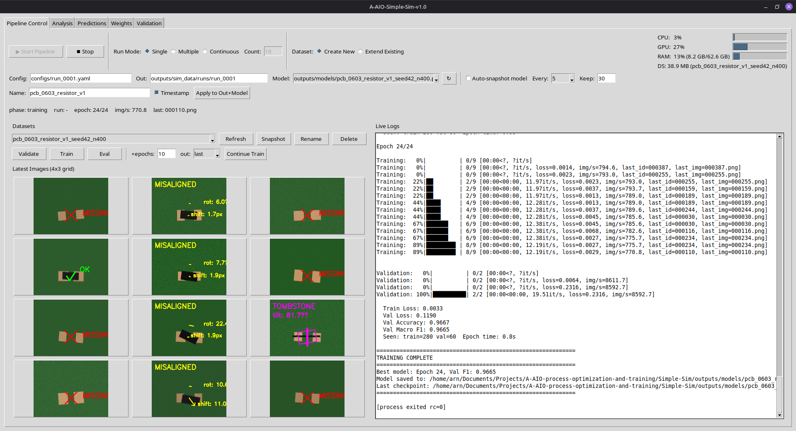

# A-AIO-process-optimization-and-training

This is a **testing / prototyping repository** for experimenting with AOI/AI concepts and implementing them as clean, reproducible building blocks.
The goal is to mature these components into a future, end-to-end production system (the production system is **not** intended to be open-source).

## Projects

- [`Simple-Sim`](Simple-Sim/README.md): synthetic dataset generation + training + evaluation

## License

This repository is **proprietary**. No permission is granted to use, copy, modify, or distribute this software without prior written permission.
See `LICENSE`.

Third-party dependencies (Python packages, etc.) remain under their own licenses; see `Simple-Sim/THIRD_PARTY_LICENSES.md`.

## What You May / May Not Do

This repository is public so others can understand the ideas and approach. It is **not** open-source.

Allowed:
- Read the code and documentation.
- Discuss concepts, provide feedback, and share high-level ideas.
- Link to this repository.

Not allowed (without prior written permission):
- Use this code (in whole or in part) in your own projects, products, or services.
- Extract or reuse individual modules, components, files, snippets, or other parts of this project.
- Copy, modify, merge, re-publish, distribute, or sublicense the code.
- Use it for commercial purposes or production deployments.

Note: On GitHub, others may be able to technically fork/clone public repositories. This does **not** grant permission to use the software beyond what is required to view it on GitHub; all other use remains strictly prohibited by `LICENSE`.

Permission requests: arn-c0de@protonmail.com
