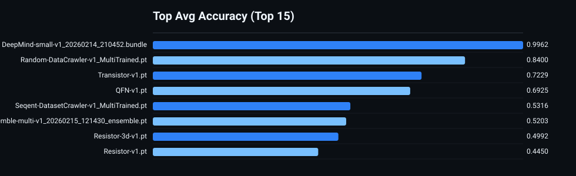
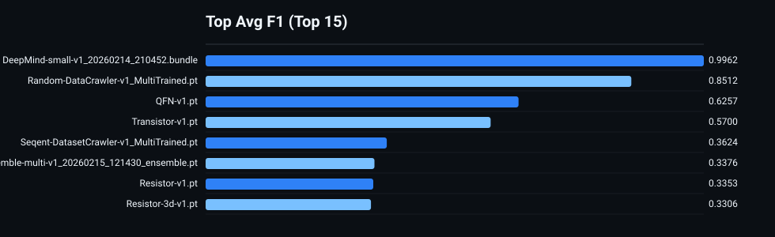
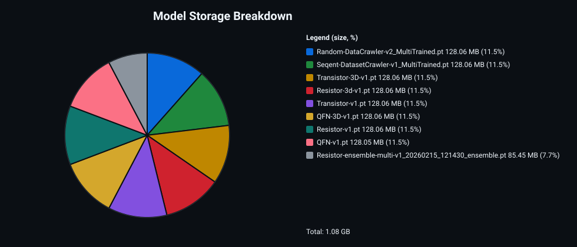
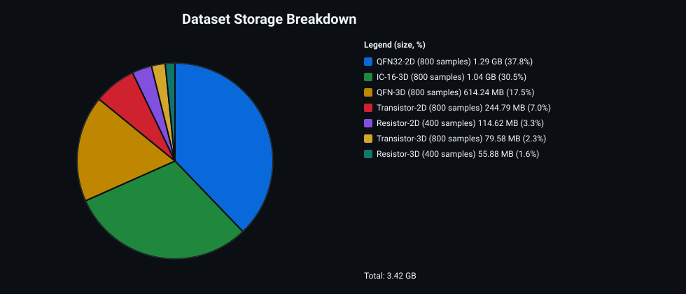

# Model Arena Report
> Last updated: 2026-02-20 16:14:07

## Quick Navigation

- [Warnings](#warnings)
- [Charts](#charts)
- [Overall Ranking](#overall-ranking)
- [Per-Dataset Breakdown](#per-dataset-breakdown)
- [Bundle Details](#bundle-details)
- [Per-Model Detail Cards](#per-model-detail-cards)
- [History](#history)

Datasets

- [CLEAN-All-90degree-profile-database](#dataset-clean-all-90degree-profile-database)
- [CLEAN-QFN-3D](#dataset-clean-qfn-3d)
- [CLEAN-QFN32-2D](#dataset-clean-qfn32-2d)
- [CLEAN-Resistor-2D](#dataset-clean-resistor-2d)
- [CLEAN-Resistor-3D](#dataset-clean-resistor-3d)
- [CLEAN-Transistor-2D](#dataset-clean-transistor-2d)
- [CLEAN-Transistor-3D](#dataset-clean-transistor-3d)
- [Filter-Default-Mixed-ALL_20260220_131657](#dataset-filter-default-mixed-all-20260220-131657)
- [IC-16-3D](#dataset-ic-16-3d)
- [QFN-3D](#dataset-qfn-3d)
- [QFN32-2D](#dataset-qfn32-2d)
- [Resistor-2D](#dataset-resistor-2d)
- [Resistor-3D](#dataset-resistor-3d)
- [Transistor-2D](#dataset-transistor-2d)
- [Transistor-3D](#dataset-transistor-3d)

Models

- [QFN-FINE-TUNED-RandomCrawler-1X.pt](#model-qfn-fine-tuned-randomcrawler-1x-pt)
- [RandomCrawler-5X.pt](#model-randomcrawler-5x-pt)
- [RandomCrawler-1X_MultiTrained.pt](#model-randomcrawler-1x-multitrained-pt)
- [FINE-TUNED-RandomCrawler-1X.pt](#model-fine-tuned-randomcrawler-1x-pt)
- [CLEAN-Transistor-2D.pt](#model-clean-transistor-2d-pt)
- [Transistor-2D.pt](#model-transistor-2d-pt)
- [IC-16-3D.pt](#model-ic-16-3d-pt)
- [Transistor-3D.pt](#model-transistor-3d-pt)
- [CLEAN-Transistor-3D.pt](#model-clean-transistor-3d-pt)
- [CLEAN-Resistor-2D.pt](#model-clean-resistor-2d-pt)
- [Resistor-2D.pt](#model-resistor-2d-pt)
- [QFN32-2D.pt](#model-qfn32-2d-pt)
- [CLEAN-QFN32-2D.pt](#model-clean-qfn32-2d-pt)
- [CLEAN-Resistor-3D.pt](#model-clean-resistor-3d-pt)
- [Resistor-3D.pt](#model-resistor-3d-pt)
- [CLEAN-IC-16-3D.pt](#model-clean-ic-16-3d-pt)
- [QFN-3D.pt](#model-qfn-3d-pt)
- [CLEAN-QFN-3D.pt](#model-clean-qfn-3d-pt)

## Warnings

Tracked paths missing on disk:
- `outputs/models/IC-16-3D.pt`
- `outputs/models/QFN-3D.pt`
- `outputs/models/QFN32-2D.pt`
- `outputs/models/Resistor-2D.pt`
- `outputs/models/Resistor-3D.pt`
- `outputs/models/Transistor-2D.pt`
- `outputs/models/Transistor-3D.pt`

## Charts

### Top Avg Accuracy

### Top Avg F1

### Model Storage Breakdown

### Dataset Storage Breakdown

## Overall Ranking

| Rank | Model | Type | Avg Accuracy | Avg F1 | Datasets Tested | Best Dataset | Worst Dataset | Last Run |
|---:|---|---|---:|---:|---:|---|---|---|
| 1 | QFN-FINE-TUNED-RandomCrawler-1X.pt | Single | 0.7704 | 0.7436 | 8 | CLEAN-Transistor-2D (0.9500) | CLEAN-QFN-3D (0.3187) | 2026-02-20 16:12:54 |
| 2 | RandomCrawler-5X.pt | Single | 0.7225 | 0.6856 | 8 | Transistor-2D (0.9925) | IC-16-3D (0.2900) | 2026-02-20 13:26:47 |
| 3 | RandomCrawler-1X_MultiTrained.pt | Single | 0.7176 | 0.6717 | 8 | Resistor-2D (0.9975) | QFN-3D (0.2500) | 2026-02-20 13:26:56 |
| 4 | FINE-TUNED-RandomCrawler-1X.pt | Single | 0.7164 | 0.6851 | 8 | Filter-Default-Mixed-ALL_20260220_131657 (0.9604) | CLEAN-QFN-3D (0.2075) | 2026-02-20 13:26:14 |
| 5 | CLEAN-Transistor-2D.pt | Single | 0.6181 | 0.5549 | 8 | CLEAN-Transistor-2D (0.9850) | CLEAN-Resistor-3D (0.2500) | 2026-02-20 13:32:31 |
| 6 | Transistor-2D.pt | Single | 0.5891 | 0.5090 | 7 | Transistor-2D (0.9850) | Resistor-3D (0.2500) | 2026-02-16 22:35:03 |
| 7 | IC-16-3D.pt | Single | 0.4888 | 0.4095 | 7 | IC-16-3D (0.9875) | Transistor-2D (0.2712) | 2026-02-16 22:41:03 |
| 8 | Transistor-3D.pt | Single | 0.4561 | 0.3526 | 7 | Transistor-3D (0.9838) | Resistor-3D (0.2500) | 2026-02-16 22:33:53 |
| 9 | CLEAN-Transistor-3D.pt | Single | 0.4552 | 0.3753 | 8 | CLEAN-Transistor-3D (0.9838) | CLEAN-Resistor-3D (0.2500) | 2026-02-20 13:30:01 |
| 10 | CLEAN-Resistor-2D.pt | Single | 0.4508 | 0.3808 | 8 | CLEAN-Resistor-2D (0.9825) | CLEAN-QFN-3D (0.2500) | 2026-02-20 13:35:09 |
| 11 | Resistor-2D.pt | Single | 0.4330 | 0.3398 | 7 | Resistor-2D (0.9825) | IC-16-3D (0.2500) | 2026-02-16 22:37:14 |
| 12 | QFN32-2D.pt | Single | 0.4280 | 0.3156 | 7 | QFN32-2D (1.0000) | QFN-3D (0.2500) | 2026-02-16 22:38:47 |
| 13 | CLEAN-QFN32-2D.pt | Single | 0.4249 | 0.3405 | 8 | CLEAN-QFN32-2D (1.0000) | CLEAN-QFN-3D (0.2500) | 2026-02-20 13:36:26 |
| 14 | CLEAN-Resistor-3D.pt | Single | 0.4199 | 0.3478 | 8 | CLEAN-Resistor-3D (0.9800) | CLEAN-QFN-3D (0.2087) | 2026-02-20 13:33:48 |
| 15 | Resistor-3D.pt | Single | 0.4030 | 0.3123 | 7 | Resistor-3D (0.9800) | QFN-3D (0.2087) | 2026-02-16 22:36:08 |
| 16 | CLEAN-IC-16-3D.pt | Single | 0.3976 | 0.3183 | 8 | CLEAN-QFN-3D (0.7250) | CLEAN-Transistor-2D (0.2712) | 2026-02-20 13:39:05 |
| 17 | QFN-3D.pt | Single | 0.3968 | 0.3182 | 7 | QFN-3D (0.9875) | Resistor-2D (0.2350) | 2026-02-16 22:39:57 |
| 18 | CLEAN-QFN-3D.pt | Single | 0.3477 | 0.2857 | 8 | CLEAN-QFN-3D (0.9875) | Filter-Default-Mixed-ALL_20260220_131657 (0.2336) | 2026-02-20 13:37:43 |

## Per-Dataset Breakdown

### Dataset: CLEAN-All-90degree-profile-database
- Size on disk: 695.59 MB
- Total samples: 11200

| Rank | Model | Accuracy | F1 | Split | Samples | Dataset Size | Last Run |
|---:|---|---:|---:|---|---:|---:|---|
| 1 | QFN-FINE-TUNED-RandomCrawler-1X.pt | 0.8715 | 0.8698 | all | 11200 | 695.59 MB | 2026-02-20 16:11:59 |
| 2 | FINE-TUNED-RandomCrawler-1X.pt | 0.8604 | 0.8605 | all | 11200 | 695.59 MB | 2026-02-20 13:25:19 |
| 3 | CLEAN-Transistor-2D.pt | 0.6579 | 0.6365 | all | 11200 | 695.59 MB | 2026-02-20 13:31:45 |
| 4 | CLEAN-Transistor-3D.pt | 0.5272 | 0.5231 | all | 11200 | 695.59 MB | 2026-02-20 13:29:14 |
| 5 | CLEAN-Resistor-3D.pt | 0.4496 | 0.4131 | all | 11200 | 695.59 MB | 2026-02-20 13:33:02 |
| 6 | CLEAN-Resistor-2D.pt | 0.4204 | 0.4085 | all | 11200 | 695.59 MB | 2026-02-20 13:34:23 |
| 7 | CLEAN-IC-16-3D.pt | 0.4163 | 0.3659 | all | 11200 | 695.59 MB | 2026-02-20 13:38:18 |
| 8 | CLEAN-QFN32-2D.pt | 0.3671 | 0.3703 | all | 11200 | 695.59 MB | 2026-02-20 13:35:39 |
| 9 | CLEAN-QFN-3D.pt | 0.2646 | 0.2303 | all | 11200 | 695.59 MB | 2026-02-20 13:36:57 |

### Dataset: CLEAN-QFN-3D
- Size on disk: 619.09 MB
- Total samples: 800

| Rank | Model | Accuracy | F1 | Split | Samples | Dataset Size | Last Run |
|---:|---|---:|---:|---|---:|---:|---|
| 1 | CLEAN-QFN-3D.pt | 0.9875 | 0.9875 | all | 800 | 619.09 MB | 2026-02-20 13:37:14 |
| 2 | CLEAN-IC-16-3D.pt | 0.7250 | 0.6648 | all | 800 | 619.09 MB | 2026-02-20 13:38:36 |
| 3 | CLEAN-Transistor-3D.pt | 0.6500 | 0.5784 | all | 800 | 619.09 MB | 2026-02-20 13:29:31 |
| 4 | CLEAN-Transistor-2D.pt | 0.3925 | 0.2671 | all | 800 | 619.09 MB | 2026-02-20 13:32:02 |
| 5 | QFN-FINE-TUNED-RandomCrawler-1X.pt | 0.3187 | 0.2760 | all | 800 | 619.09 MB | 2026-02-20 16:12:17 |
| 6 | CLEAN-QFN32-2D.pt | 0.2500 | 0.1000 | all | 800 | 619.09 MB | 2026-02-20 13:35:57 |
| 7 | CLEAN-Resistor-2D.pt | 0.2500 | 0.1000 | all | 800 | 619.09 MB | 2026-02-20 13:34:40 |
| 8 | CLEAN-Resistor-3D.pt | 0.2087 | 0.1557 | all | 800 | 619.09 MB | 2026-02-20 13:33:19 |
| 9 | FINE-TUNED-RandomCrawler-1X.pt | 0.2075 | 0.1157 | all | 800 | 619.09 MB | 2026-02-20 13:25:36 |

### Dataset: CLEAN-QFN32-2D
- Size on disk: 1.30 GB
- Total samples: 800

| Rank | Model | Accuracy | F1 | Split | Samples | Dataset Size | Last Run |
|---:|---|---:|---:|---|---:|---:|---|
| 1 | CLEAN-QFN32-2D.pt | 1.0000 | 1.0000 | all | 800 | 1.30 GB | 2026-02-20 13:36:11 |
| 2 | CLEAN-Transistor-2D.pt | 0.5487 | 0.4744 | all | 800 | 1.30 GB | 2026-02-20 13:32:16 |
| 3 | QFN-FINE-TUNED-RandomCrawler-1X.pt | 0.5425 | 0.4601 | all | 800 | 1.30 GB | 2026-02-20 16:12:30 |
| 4 | CLEAN-Resistor-2D.pt | 0.4150 | 0.3548 | all | 800 | 1.30 GB | 2026-02-20 13:34:54 |
| 5 | CLEAN-Resistor-3D.pt | 0.3800 | 0.2710 | all | 800 | 1.30 GB | 2026-02-20 13:33:34 |
| 6 | FINE-TUNED-RandomCrawler-1X.pt | 0.3150 | 0.2108 | all | 800 | 1.30 GB | 2026-02-20 13:25:50 |
| 7 | CLEAN-IC-16-3D.pt | 0.2800 | 0.1605 | all | 800 | 1.30 GB | 2026-02-20 13:38:50 |
| 8 | CLEAN-QFN-3D.pt | 0.2650 | 0.1392 | all | 800 | 1.30 GB | 2026-02-20 13:37:29 |
| 9 | CLEAN-Transistor-3D.pt | 0.2525 | 0.1186 | all | 800 | 1.30 GB | 2026-02-20 13:29:46 |

### Dataset: CLEAN-Resistor-2D
- Size on disk: 116.87 MB
- Total samples: 400

| Rank | Model | Accuracy | F1 | Split | Samples | Dataset Size | Last Run |
|---:|---|---:|---:|---|---:|---:|---|
| 1 | CLEAN-Resistor-2D.pt | 0.9825 | 0.9825 | all | 400 | 116.87 MB | 2026-02-20 13:34:58 |
| 2 | CLEAN-Transistor-2D.pt | 0.9650 | 0.9650 | all | 400 | 116.87 MB | 2026-02-20 13:32:19 |
| 3 | QFN-FINE-TUNED-RandomCrawler-1X.pt | 0.9400 | 0.9398 | all | 400 | 116.87 MB | 2026-02-20 16:12:34 |
| 4 | FINE-TUNED-RandomCrawler-1X.pt | 0.9225 | 0.9221 | all | 400 | 116.87 MB | 2026-02-20 13:25:53 |
| 5 | CLEAN-QFN32-2D.pt | 0.4775 | 0.3218 | all | 400 | 116.87 MB | 2026-02-20 13:36:14 |
| 6 | CLEAN-IC-16-3D.pt | 0.2950 | 0.2102 | all | 400 | 116.87 MB | 2026-02-20 13:38:54 |
| 7 | CLEAN-Transistor-3D.pt | 0.2800 | 0.1566 | all | 400 | 116.87 MB | 2026-02-20 13:29:49 |
| 8 | CLEAN-Resistor-3D.pt | 0.2575 | 0.1350 | all | 400 | 116.87 MB | 2026-02-20 13:33:37 |
| 9 | CLEAN-QFN-3D.pt | 0.2350 | 0.2379 | all | 400 | 116.87 MB | 2026-02-20 13:37:32 |

### Dataset: CLEAN-Resistor-3D
- Size on disk: 58.12 MB
- Total samples: 400

| Rank | Model | Accuracy | F1 | Split | Samples | Dataset Size | Last Run |
|---:|---|---:|---:|---|---:|---:|---|
| 1 | CLEAN-Resistor-3D.pt | 0.9800 | 0.9800 | all | 400 | 58.12 MB | 2026-02-20 13:33:40 |
| 2 | QFN-FINE-TUNED-RandomCrawler-1X.pt | 0.6925 | 0.6049 | all | 400 | 58.12 MB | 2026-02-20 16:12:37 |
| 3 | FINE-TUNED-RandomCrawler-1X.pt | 0.6875 | 0.6312 | all | 400 | 58.12 MB | 2026-02-20 13:25:57 |
| 4 | CLEAN-IC-16-3D.pt | 0.2850 | 0.1575 | all | 400 | 58.12 MB | 2026-02-20 13:38:57 |
| 5 | CLEAN-QFN-3D.pt | 0.2600 | 0.1221 | all | 400 | 58.12 MB | 2026-02-20 13:37:35 |
| 6 | CLEAN-QFN32-2D.pt | 0.2500 | 0.1139 | all | 400 | 58.12 MB | 2026-02-20 13:36:18 |
| 7 | CLEAN-Transistor-3D.pt | 0.2500 | 0.1012 | all | 400 | 58.12 MB | 2026-02-20 13:29:53 |
| 8 | CLEAN-Resistor-2D.pt | 0.2500 | 0.1000 | all | 400 | 58.12 MB | 2026-02-20 13:35:01 |
| 9 | CLEAN-Transistor-2D.pt | 0.2500 | 0.1000 | all | 400 | 58.12 MB | 2026-02-20 13:32:23 |

### Dataset: CLEAN-Transistor-2D
- Size on disk: 249.28 MB
- Total samples: 800

| Rank | Model | Accuracy | F1 | Split | Samples | Dataset Size | Last Run |
|---:|---|---:|---:|---|---:|---:|---|
| 1 | CLEAN-Transistor-2D.pt | 0.9850 | 0.9850 | all | 800 | 249.28 MB | 2026-02-20 13:32:27 |
| 2 | QFN-FINE-TUNED-RandomCrawler-1X.pt | 0.9500 | 0.9497 | all | 800 | 249.28 MB | 2026-02-20 16:12:41 |
| 3 | FINE-TUNED-RandomCrawler-1X.pt | 0.9413 | 0.9408 | all | 800 | 249.28 MB | 2026-02-20 13:26:01 |
| 4 | CLEAN-Resistor-2D.pt | 0.6338 | 0.6416 | all | 800 | 249.28 MB | 2026-02-20 13:35:05 |
| 5 | CLEAN-QFN32-2D.pt | 0.4550 | 0.3084 | all | 800 | 249.28 MB | 2026-02-20 13:36:22 |
| 6 | CLEAN-IC-16-3D.pt | 0.2712 | 0.1725 | all | 800 | 249.28 MB | 2026-02-20 13:39:01 |
| 7 | CLEAN-Transistor-3D.pt | 0.2650 | 0.1295 | all | 800 | 249.28 MB | 2026-02-20 13:29:57 |
| 8 | CLEAN-Resistor-3D.pt | 0.2575 | 0.1263 | all | 800 | 249.28 MB | 2026-02-20 13:33:44 |
| 9 | CLEAN-QFN-3D.pt | 0.2437 | 0.1892 | all | 800 | 249.28 MB | 2026-02-20 13:37:39 |

### Dataset: CLEAN-Transistor-3D
- Size on disk: 84.12 MB
- Total samples: 800

| Rank | Model | Accuracy | F1 | Split | Samples | Dataset Size | Last Run |
|---:|---|---:|---:|---|---:|---:|---|
| 1 | CLEAN-Transistor-3D.pt | 0.9838 | 0.9837 | all | 800 | 84.12 MB | 2026-02-20 13:30:01 |
| 2 | QFN-FINE-TUNED-RandomCrawler-1X.pt | 0.9038 | 0.9046 | all | 800 | 84.12 MB | 2026-02-20 16:12:44 |
| 3 | FINE-TUNED-RandomCrawler-1X.pt | 0.8363 | 0.8393 | all | 800 | 84.12 MB | 2026-02-20 13:26:05 |
| 4 | CLEAN-IC-16-3D.pt | 0.5775 | 0.5134 | all | 800 | 84.12 MB | 2026-02-20 13:39:05 |
| 5 | CLEAN-Transistor-2D.pt | 0.5363 | 0.4327 | all | 800 | 84.12 MB | 2026-02-20 13:32:31 |
| 6 | CLEAN-Resistor-3D.pt | 0.5000 | 0.3798 | all | 800 | 84.12 MB | 2026-02-20 13:33:48 |
| 7 | CLEAN-QFN-3D.pt | 0.2925 | 0.1791 | all | 800 | 84.12 MB | 2026-02-20 13:37:43 |
| 8 | CLEAN-QFN32-2D.pt | 0.2625 | 0.1769 | all | 800 | 84.12 MB | 2026-02-20 13:36:26 |
| 9 | CLEAN-Resistor-2D.pt | 0.2500 | 0.1000 | all | 800 | 84.12 MB | 2026-02-20 13:35:09 |

### Dataset: Filter-Default-Mixed-ALL_20260220_131657
- Size on disk: 144.44 MB
- Total samples: 2800

| Rank | Model | Accuracy | F1 | Split | Samples | Dataset Size | Last Run |
|---:|---|---:|---:|---|---:|---:|---|
| 1 | FINE-TUNED-RandomCrawler-1X.pt | 0.9604 | 0.9605 | all | 2800 | 144.44 MB | 2026-02-20 13:26:14 |
| 2 | QFN-FINE-TUNED-RandomCrawler-1X.pt | 0.9443 | 0.9440 | all | 2800 | 144.44 MB | 2026-02-20 16:12:54 |
| 3 | RandomCrawler-5X.pt | 0.7614 | 0.7641 | all | 2800 | 144.44 MB | 2026-02-20 13:26:47 |
| 4 | RandomCrawler-1X_MultiTrained.pt | 0.7336 | 0.7426 | all | 2800 | 144.44 MB | 2026-02-20 13:26:56 |
| 5 | CLEAN-Transistor-2D.pt | 0.6093 | 0.5786 | all | 2800 | 144.44 MB | 2026-02-20 13:27:16 |
| 6 | CLEAN-Transistor-3D.pt | 0.4329 | 0.4115 | all | 2800 | 144.44 MB | 2026-02-20 13:27:07 |
| 7 | CLEAN-Resistor-2D.pt | 0.4046 | 0.3593 | all | 2800 | 144.44 MB | 2026-02-20 13:27:38 |
| 8 | CLEAN-QFN32-2D.pt | 0.3371 | 0.3330 | all | 2800 | 144.44 MB | 2026-02-20 13:27:49 |
| 9 | CLEAN-IC-16-3D.pt | 0.3311 | 0.3013 | all | 2800 | 144.44 MB | 2026-02-20 13:28:09 |
| 10 | CLEAN-Resistor-3D.pt | 0.3257 | 0.3219 | all | 2800 | 144.44 MB | 2026-02-20 13:27:28 |
| 11 | CLEAN-QFN-3D.pt | 0.2336 | 0.2004 | all | 2800 | 144.44 MB | 2026-02-20 13:28:39 |

### Dataset: IC-16-3D
- Size on disk: -
- Total samples: 800

| Rank | Model | Accuracy | F1 | Split | Samples | Dataset Size | Last Run |
|---:|---|---:|---:|---|---:|---:|---|
| 1 | IC-16-3D.pt | 0.9875 | 0.9875 | all | 800 | 0 B | 2026-02-16 22:40:21 |
| 2 | Transistor-3D.pt | 0.5112 | 0.4004 | all | 800 | 0 B | 2026-02-16 22:33:11 |
| 3 | RandomCrawler-1X_MultiTrained.pt | 0.4975 | 0.3734 | all | 800 | 0 B | 2026-02-16 22:31:46 |
| 4 | QFN-3D.pt | 0.4938 | 0.3725 | all | 800 | 0 B | 2026-02-16 22:39:12 |
| 5 | Transistor-2D.pt | 0.4462 | 0.3385 | all | 800 | 0 B | 2026-02-16 22:34:19 |
| 6 | QFN32-2D.pt | 0.3013 | 0.1883 | all | 800 | 0 B | 2026-02-16 22:38:03 |
| 7 | RandomCrawler-5X.pt | 0.2900 | 0.1775 | all | 800 | 0 B | 2026-02-16 22:55:45 |
| 8 | Resistor-2D.pt | 0.2500 | 0.1000 | all | 800 | 0 B | 2026-02-16 22:36:31 |
| 9 | Resistor-3D.pt | 0.2375 | 0.1386 | all | 800 | 0 B | 2026-02-16 22:35:25 |

### Dataset: QFN-3D
- Size on disk: -
- Total samples: 800

| Rank | Model | Accuracy | F1 | Split | Samples | Dataset Size | Last Run |
|---:|---|---:|---:|---|---:|---:|---|
| 1 | QFN-3D.pt | 0.9875 | 0.9875 | all | 800 | 0 B | 2026-02-16 22:39:28 |
| 2 | IC-16-3D.pt | 0.7250 | 0.6648 | all | 800 | 0 B | 2026-02-16 22:40:34 |
| 3 | Transistor-3D.pt | 0.6500 | 0.5784 | all | 800 | 0 B | 2026-02-16 22:33:25 |
| 4 | RandomCrawler-5X.pt | 0.4400 | 0.3345 | all | 800 | 0 B | 2026-02-16 22:56:00 |
| 5 | Transistor-2D.pt | 0.3925 | 0.2671 | all | 800 | 0 B | 2026-02-16 22:34:33 |
| 6 | RandomCrawler-1X_MultiTrained.pt | 0.2500 | 0.1000 | all | 800 | 0 B | 2026-02-20 11:03:43 |
| 7 | QFN32-2D.pt | 0.2500 | 0.1000 | all | 800 | 0 B | 2026-02-16 22:38:17 |
| 8 | Resistor-2D.pt | 0.2500 | 0.1000 | all | 800 | 0 B | 2026-02-16 22:36:45 |
| 9 | Resistor-3D.pt | 0.2087 | 0.1557 | all | 800 | 0 B | 2026-02-16 22:35:39 |

### Dataset: QFN32-2D
- Size on disk: -
- Total samples: 800

| Rank | Model | Accuracy | F1 | Split | Samples | Dataset Size | Last Run |
|---:|---|---:|---:|---|---:|---:|---|
| 1 | QFN32-2D.pt | 1.0000 | 1.0000 | all | 800 | 0 B | 2026-02-16 22:38:32 |
| 2 | Transistor-2D.pt | 0.5487 | 0.4744 | all | 800 | 0 B | 2026-02-16 22:34:48 |
| 3 | Resistor-2D.pt | 0.4150 | 0.3548 | all | 800 | 0 B | 2026-02-16 22:36:59 |
| 4 | Resistor-3D.pt | 0.3800 | 0.2710 | all | 800 | 0 B | 2026-02-16 22:35:53 |
| 5 | RandomCrawler-5X.pt | 0.3438 | 0.2640 | all | 800 | 0 B | 2026-02-16 22:56:14 |
| 6 | RandomCrawler-1X_MultiTrained.pt | 0.3075 | 0.2054 | all | 800 | 0 B | 2026-02-20 11:01:27 |
| 7 | IC-16-3D.pt | 0.2800 | 0.1605 | all | 800 | 0 B | 2026-02-16 22:40:49 |
| 8 | QFN-3D.pt | 0.2650 | 0.1392 | all | 800 | 0 B | 2026-02-16 22:39:42 |
| 9 | Transistor-3D.pt | 0.2525 | 0.1186 | all | 800 | 0 B | 2026-02-16 22:33:39 |

### Dataset: Resistor-2D
- Size on disk: -
- Total samples: 400

| Rank | Model | Accuracy | F1 | Split | Samples | Dataset Size | Last Run |
|---:|---|---:|---:|---|---:|---:|---|
| 1 | RandomCrawler-1X_MultiTrained.pt | 0.9975 | 0.9975 | all | 400 | 0 B | 2026-02-20 11:01:30 |
| 2 | RandomCrawler-5X.pt | 0.9900 | 0.9900 | all | 400 | 0 B | 2026-02-16 22:56:18 |
| 3 | Resistor-2D.pt | 0.9825 | 0.9825 | all | 400 | 0 B | 2026-02-16 22:37:03 |
| 4 | Transistor-2D.pt | 0.9650 | 0.9650 | all | 400 | 0 B | 2026-02-16 22:34:52 |
| 5 | QFN32-2D.pt | 0.4775 | 0.3218 | all | 400 | 0 B | 2026-02-16 22:38:35 |
| 6 | IC-16-3D.pt | 0.2950 | 0.2102 | all | 400 | 0 B | 2026-02-16 22:40:52 |
| 7 | Transistor-3D.pt | 0.2800 | 0.1566 | all | 400 | 0 B | 2026-02-16 22:33:42 |
| 8 | Resistor-3D.pt | 0.2575 | 0.1350 | all | 400 | 0 B | 2026-02-16 22:35:56 |
| 9 | QFN-3D.pt | 0.2350 | 0.2379 | all | 400 | 0 B | 2026-02-16 22:39:45 |

### Dataset: Resistor-3D
- Size on disk: -
- Total samples: 400

| Rank | Model | Accuracy | F1 | Split | Samples | Dataset Size | Last Run |
|---:|---|---:|---:|---|---:|---:|---|
| 1 | Resistor-3D.pt | 0.9800 | 0.9800 | all | 400 | 0 B | 2026-02-16 22:36:00 |
| 2 | RandomCrawler-1X_MultiTrained.pt | 0.9775 | 0.9775 | all | 400 | 0 B | 2026-02-20 11:01:34 |
| 3 | RandomCrawler-5X.pt | 0.9725 | 0.9724 | all | 400 | 0 B | 2026-02-16 22:56:21 |
| 4 | IC-16-3D.pt | 0.2850 | 0.1575 | all | 400 | 0 B | 2026-02-16 22:40:55 |
| 5 | QFN-3D.pt | 0.2600 | 0.1221 | all | 400 | 0 B | 2026-02-16 22:39:49 |
| 6 | QFN32-2D.pt | 0.2500 | 0.1139 | all | 400 | 0 B | 2026-02-16 22:38:39 |
| 7 | Transistor-3D.pt | 0.2500 | 0.1012 | all | 400 | 0 B | 2026-02-16 22:33:45 |
| 8 | Resistor-2D.pt | 0.2500 | 0.1000 | all | 400 | 0 B | 2026-02-16 22:37:06 |
| 9 | Transistor-2D.pt | 0.2500 | 0.1000 | all | 400 | 0 B | 2026-02-16 22:34:55 |

### Dataset: Transistor-2D
- Size on disk: -
- Total samples: 800

| Rank | Model | Accuracy | F1 | Split | Samples | Dataset Size | Last Run |
|---:|---|---:|---:|---|---:|---:|---|
| 1 | RandomCrawler-5X.pt | 0.9925 | 0.9925 | all | 800 | 0 B | 2026-02-16 22:56:25 |
| 2 | RandomCrawler-1X_MultiTrained.pt | 0.9900 | 0.9900 | all | 800 | 0 B | 2026-02-20 11:01:38 |
| 3 | Transistor-2D.pt | 0.9850 | 0.9850 | all | 800 | 0 B | 2026-02-16 22:34:59 |
| 4 | Resistor-2D.pt | 0.6338 | 0.6416 | all | 800 | 0 B | 2026-02-16 22:37:10 |
| 5 | QFN32-2D.pt | 0.4550 | 0.3084 | all | 800 | 0 B | 2026-02-16 22:38:43 |
| 6 | IC-16-3D.pt | 0.2712 | 0.1725 | all | 800 | 0 B | 2026-02-16 22:40:59 |
| 7 | Transistor-3D.pt | 0.2650 | 0.1295 | all | 800 | 0 B | 2026-02-16 22:33:49 |
| 8 | Resistor-3D.pt | 0.2575 | 0.1263 | all | 800 | 0 B | 2026-02-16 22:36:04 |
| 9 | QFN-3D.pt | 0.2437 | 0.1892 | all | 800 | 0 B | 2026-02-16 22:39:53 |

### Dataset: Transistor-3D
- Size on disk: -
- Total samples: 800

| Rank | Model | Accuracy | F1 | Split | Samples | Dataset Size | Last Run |
|---:|---|---:|---:|---|---:|---:|---|
| 1 | RandomCrawler-5X.pt | 0.9900 | 0.9900 | all | 800 | 0 B | 2026-02-16 22:56:29 |
| 2 | RandomCrawler-1X_MultiTrained.pt | 0.9875 | 0.9875 | all | 800 | 0 B | 2026-02-20 11:01:43 |
| 3 | Transistor-3D.pt | 0.9838 | 0.9837 | all | 800 | 0 B | 2026-02-16 22:33:53 |
| 4 | IC-16-3D.pt | 0.5775 | 0.5134 | all | 800 | 0 B | 2026-02-16 22:41:03 |
| 5 | Transistor-2D.pt | 0.5363 | 0.4327 | all | 800 | 0 B | 2026-02-16 22:35:03 |
| 6 | Resistor-3D.pt | 0.5000 | 0.3798 | all | 800 | 0 B | 2026-02-16 22:36:08 |
| 7 | QFN-3D.pt | 0.2925 | 0.1791 | all | 800 | 0 B | 2026-02-16 22:39:57 |
| 8 | QFN32-2D.pt | 0.2625 | 0.1769 | all | 800 | 0 B | 2026-02-16 22:38:47 |
| 9 | Resistor-2D.pt | 0.2500 | 0.1000 | all | 800 | 0 B | 2026-02-16 22:37:14 |

## Bundle Details

- (No bundle models tracked)

## Per-Model Detail Cards

### QFN-FINE-TUNED-RandomCrawler-1X.pt (Single)

| Dataset | Split | Accuracy | F1 | Critical FN | Samples | Dataset Size | Epoch | Val Acc | Speed |
|---|---|---:|---:|---|---:|---:|---:|---:|---:|
| CLEAN-All-90degree-profile-database | all | 0.8715 | 0.8698 | MISALIGNED:0.1232 MISSING:0.0029 TOMBSTONE:0.0764 | 11200 | 695.59 MB | 8 | 0.9443 | 683.2 img/s |
| CLEAN-QFN-3D | all | 0.3187 | 0.2760 | MISALIGNED:0.1250 MISSING:0.6000 TOMBSTONE:1.0000 | 800 | 619.09 MB | 10 | 0.9315 | 76.9 img/s |
| CLEAN-QFN32-2D | all | 0.5425 | 0.4601 | MISALIGNED:0.0200 MISSING:0.0250 TOMBSTONE:0.7850 | 800 | 1.30 GB | 8 | 0.9443 | 69.5 img/s |
| CLEAN-Resistor-2D | all | 0.9400 | 0.9398 | MISALIGNED:0.0900 MISSING:0.0000 TOMBSTONE:0.0000 | 400 | 116.87 MB | 8 | 0.9443 | 477.5 img/s |
| CLEAN-Resistor-3D | all | 0.6925 | 0.6049 | MISALIGNED:0.1800 MISSING:0.0000 TOMBSTONE:1.0000 | 400 | 58.12 MB | 10 | 0.9315 | 549.5 img/s |
| CLEAN-Transistor-2D | all | 0.9500 | 0.9497 | MISALIGNED:0.0250 MISSING:0.0000 TOMBSTONE:0.0000 | 800 | 249.28 MB | 6 | 0.9424 | 530.9 img/s |
| CLEAN-Transistor-3D | all | 0.9038 | 0.9046 | MISALIGNED:0.0500 MISSING:0.0000 TOMBSTONE:0.1000 | 800 | 84.12 MB | 8 | 0.9443 | 559.7 img/s |
| Filter-Default-Mixed-ALL_20260220_131657 | all | 0.9443 | 0.9440 | MISALIGNED:0.0843 MISSING:0.0000 TOMBSTONE:0.0214 | 2800 | 144.44 MB | 8 | 0.9443 | 654.6 img/s |

### RandomCrawler-5X.pt (Single)

| Dataset | Split | Accuracy | F1 | Critical FN | Samples | Dataset Size | Epoch | Val Acc | Speed |
|---|---|---:|---:|---|---:|---:|---:|---:|---:|
| Filter-Default-Mixed-ALL_20260220_131657 | all | 0.7614 | 0.7641 | MISALIGNED:0.0529 MISSING:0.0686 TOMBSTONE:0.4300 | 2800 | 144.44 MB | 13 | 0.9804 | 571.8 img/s |
| IC-16-3D | all | 0.2900 | 0.1775 | MISALIGNED:0.0000 MISSING:0.8400 TOMBSTONE:1.0000 | 800 | 0 B | 13 | 0.9804 | 51.6 img/s |
| QFN-3D | all | 0.4400 | 0.3345 | MISALIGNED:0.0000 MISSING:0.2400 TOMBSTONE:1.0000 | 800 | 0 B | 13 | 0.9804 | 66.9 img/s |
| QFN32-2D | all | 0.3438 | 0.2640 | MISALIGNED:0.0550 MISSING:0.6100 TOMBSTONE:1.0000 | 800 | 0 B | 13 | 0.9804 | 66.0 img/s |
| Resistor-2D | all | 0.9900 | 0.9900 | MISALIGNED:0.0300 MISSING:0.0000 TOMBSTONE:0.0000 | 400 | 0 B | 13 | 0.9804 | 473.1 img/s |
| Resistor-3D | all | 0.9725 | 0.9724 | MISALIGNED:0.1100 MISSING:0.0000 TOMBSTONE:0.0000 | 400 | 0 B | 13 | 0.9804 | 553.0 img/s |
| Transistor-2D | all | 0.9925 | 0.9925 | MISALIGNED:0.0250 MISSING:0.0000 TOMBSTONE:0.0000 | 800 | 0 B | 13 | 0.9804 | 528.4 img/s |
| Transistor-3D | all | 0.9900 | 0.9900 | MISALIGNED:0.0100 MISSING:0.0000 TOMBSTONE:0.0000 | 800 | 0 B | 13 | 0.9804 | 600.0 img/s |

### RandomCrawler-1X_MultiTrained.pt (Single)

| Dataset | Split | Accuracy | F1 | Critical FN | Samples | Dataset Size | Epoch | Val Acc | Speed |
|---|---|---:|---:|---|---:|---:|---:|---:|---:|
| Filter-Default-Mixed-ALL_20260220_131657 | all | 0.7336 | 0.7426 | MISALIGNED:0.0286 MISSING:0.1543 TOMBSTONE:0.4086 | 2800 | 144.44 MB | 12 | 0.9750 | 615.1 img/s |
| IC-16-3D | all | 0.4975 | 0.3734 | MISALIGNED:0.0000 MISSING:0.0100 TOMBSTONE:1.0000 | 800 | 0 B | 12 | 0.9750 | 52.6 img/s |
| QFN-3D | all | 0.2500 | 0.1000 | MISALIGNED:0.0000 MISSING:1.0000 TOMBSTONE:1.0000 | 800 | 0 B | 12 | 0.9750 | 77.4 img/s |
| QFN32-2D | all | 0.3075 | 0.2054 | MISALIGNED:0.0000 MISSING:0.8250 TOMBSTONE:0.9450 | 800 | 0 B | 12 | 0.9750 | 62.6 img/s |
| Resistor-2D | all | 0.9975 | 0.9975 | MISALIGNED:0.0100 MISSING:0.0000 TOMBSTONE:0.0000 | 400 | 0 B | 12 | 0.9750 | 440.3 img/s |
| Resistor-3D | all | 0.9775 | 0.9775 | MISALIGNED:0.0700 MISSING:0.0000 TOMBSTONE:0.0200 | 400 | 0 B | 12 | 0.9750 | 457.7 img/s |
| Transistor-2D | all | 0.9900 | 0.9900 | MISALIGNED:0.0350 MISSING:0.0000 TOMBSTONE:0.0000 | 800 | 0 B | 12 | 0.9750 | 432.2 img/s |
| Transistor-3D | all | 0.9875 | 0.9875 | MISALIGNED:0.0400 MISSING:0.0000 TOMBSTONE:0.0000 | 800 | 0 B | 12 | 0.9750 | 461.9 img/s |

### FINE-TUNED-RandomCrawler-1X.pt (Single)

| Dataset | Split | Accuracy | F1 | Critical FN | Samples | Dataset Size | Epoch | Val Acc | Speed |
|---|---|---:|---:|---|---:|---:|---:|---:|---:|
| CLEAN-All-90degree-profile-database | all | 0.8604 | 0.8605 | MISALIGNED:0.0854 MISSING:0.0225 TOMBSTONE:0.2007 | 11200 | 695.59 MB | 10 | 0.9452 | 606.9 img/s |
| CLEAN-QFN-3D | all | 0.2075 | 0.1157 | MISALIGNED:0.2050 MISSING:0.9950 TOMBSTONE:0.9700 | 800 | 619.09 MB | 10 | 0.9452 | 72.2 img/s |
| CLEAN-QFN32-2D | all | 0.3150 | 0.2108 | MISALIGNED:0.0000 MISSING:0.7500 TOMBSTONE:0.9950 | 800 | 1.30 GB | 10 | 0.9452 | 68.2 img/s |
| CLEAN-Resistor-2D | all | 0.9225 | 0.9221 | MISALIGNED:0.0800 MISSING:0.0000 TOMBSTONE:0.0000 | 400 | 116.87 MB | 10 | 0.9452 | 478.4 img/s |
| CLEAN-Resistor-3D | all | 0.6875 | 0.6312 | MISALIGNED:0.3000 MISSING:0.0000 TOMBSTONE:0.9300 | 400 | 58.12 MB | 10 | 0.9452 | 539.3 img/s |
| CLEAN-Transistor-2D | all | 0.9413 | 0.9408 | MISALIGNED:0.0200 MISSING:0.0200 TOMBSTONE:0.0000 | 800 | 249.28 MB | 10 | 0.9452 | 513.5 img/s |
| CLEAN-Transistor-3D | all | 0.8363 | 0.8393 | MISALIGNED:0.0100 MISSING:0.1350 TOMBSTONE:0.2250 | 800 | 84.12 MB | 10 | 0.9452 | 591.3 img/s |
| Filter-Default-Mixed-ALL_20260220_131657 | all | 0.9604 | 0.9605 | MISALIGNED:0.0529 MISSING:0.0000 TOMBSTONE:0.0371 | 2800 | 144.44 MB | 10 | 0.9452 | 658.0 img/s |

### CLEAN-Transistor-2D.pt (Single)

| Dataset | Split | Accuracy | F1 | Critical FN | Samples | Dataset Size | Epoch | Val Acc | Speed |
|---|---|---:|---:|---|---:|---:|---:|---:|---:|
| CLEAN-All-90degree-profile-database | all | 0.6579 | 0.6365 | MISALIGNED:0.1407 MISSING:0.0000 TOMBSTONE:0.6436 | 11200 | 695.59 MB | 12 | 0.9667 | 631.3 img/s |
| CLEAN-QFN-3D | all | 0.3925 | 0.2671 | MISALIGNED:0.4300 MISSING:0.0000 TOMBSTONE:1.0000 | 800 | 619.09 MB | 12 | 0.9667 | 74.2 img/s |
| CLEAN-QFN32-2D | all | 0.5487 | 0.4744 | MISALIGNED:0.1000 MISSING:0.0000 TOMBSTONE:1.0000 | 800 | 1.30 GB | 12 | 0.9667 | 69.0 img/s |
| CLEAN-Resistor-2D | all | 0.9650 | 0.9650 | MISALIGNED:0.0700 MISSING:0.0000 TOMBSTONE:0.0000 | 400 | 116.87 MB | 12 | 0.9667 | 469.1 img/s |
| CLEAN-Resistor-3D | all | 0.2500 | 0.1000 | MISALIGNED:1.0000 MISSING:0.0000 TOMBSTONE:1.0000 | 400 | 58.12 MB | 12 | 0.9667 | 508.0 img/s |
| CLEAN-Transistor-2D | all | 0.9850 | 0.9850 | MISALIGNED:0.0150 MISSING:0.0000 TOMBSTONE:0.0000 | 800 | 249.28 MB | 12 | 0.9667 | 515.9 img/s |
| CLEAN-Transistor-3D | all | 0.5363 | 0.4327 | MISALIGNED:0.0000 MISSING:0.0000 TOMBSTONE:0.8550 | 800 | 84.12 MB | 12 | 0.9667 | 568.0 img/s |
| Filter-Default-Mixed-ALL_20260220_131657 | all | 0.6093 | 0.5786 | MISALIGNED:0.2114 MISSING:0.0200 TOMBSTONE:0.6957 | 2800 | 144.44 MB | 12 | 0.9667 | 572.1 img/s |

### Transistor-2D.pt (Single)

| Dataset | Split | Accuracy | F1 | Critical FN | Samples | Dataset Size | Epoch | Val Acc | Speed |
|---|---|---:|---:|---|---:|---:|---:|---:|---:|
| IC-16-3D | all | 0.4462 | 0.3385 | MISALIGNED:0.0000 MISSING:0.2150 TOMBSTONE:1.0000 | 800 | 0 B | 12 | 0.9667 | 52.4 img/s |
| QFN-3D | all | 0.3925 | 0.2671 | MISALIGNED:0.4300 MISSING:0.0000 TOMBSTONE:1.0000 | 800 | 0 B | 12 | 0.9667 | 70.2 img/s |
| QFN32-2D | all | 0.5487 | 0.4744 | MISALIGNED:0.1000 MISSING:0.0000 TOMBSTONE:1.0000 | 800 | 0 B | 12 | 0.9667 | 62.6 img/s |
| Resistor-2D | all | 0.9650 | 0.9650 | MISALIGNED:0.0700 MISSING:0.0000 TOMBSTONE:0.0000 | 400 | 0 B | 12 | 0.9667 | 476.6 img/s |
| Resistor-3D | all | 0.2500 | 0.1000 | MISALIGNED:1.0000 MISSING:0.0000 TOMBSTONE:1.0000 | 400 | 0 B | 12 | 0.9667 | 546.7 img/s |
| Transistor-2D | all | 0.9850 | 0.9850 | MISALIGNED:0.0150 MISSING:0.0000 TOMBSTONE:0.0000 | 800 | 0 B | 12 | 0.9667 | 533.3 img/s |
| Transistor-3D | all | 0.5363 | 0.4327 | MISALIGNED:0.0000 MISSING:0.0000 TOMBSTONE:0.8550 | 800 | 0 B | 12 | 0.9667 | 603.1 img/s |

### IC-16-3D.pt (Single)

| Dataset | Split | Accuracy | F1 | Critical FN | Samples | Dataset Size | Epoch | Val Acc | Speed |
|---|---|---:|---:|---|---:|---:|---:|---:|---:|
| IC-16-3D | all | 0.9875 | 0.9875 | MISALIGNED:0.0300 MISSING:0.0000 TOMBSTONE:0.0000 | 800 | 0 B | 2 | 1.0000 | 47.0 img/s |
| QFN-3D | all | 0.7250 | 0.6648 | MISALIGNED:0.1600 MISSING:0.0000 TOMBSTONE:0.8650 | 800 | 0 B | 2 | 1.0000 | 74.4 img/s |
| QFN32-2D | all | 0.2800 | 0.1605 | MISALIGNED:0.0150 MISSING:0.9650 TOMBSTONE:0.9000 | 800 | 0 B | 2 | 1.0000 | 68.0 img/s |
| Resistor-2D | all | 0.2950 | 0.2102 | MISALIGNED:0.2700 MISSING:0.9500 TOMBSTONE:0.6000 | 400 | 0 B | 2 | 1.0000 | 482.2 img/s |
| Resistor-3D | all | 0.2850 | 0.1575 | MISALIGNED:1.0000 MISSING:0.0000 TOMBSTONE:0.8600 | 400 | 0 B | 2 | 1.0000 | 548.6 img/s |
| Transistor-2D | all | 0.2712 | 0.1725 | MISALIGNED:0.2150 MISSING:1.0000 TOMBSTONE:0.7000 | 800 | 0 B | 2 | 1.0000 | 523.8 img/s |
| Transistor-3D | all | 0.5775 | 0.5134 | MISALIGNED:0.5950 MISSING:0.0000 TOMBSTONE:0.0950 | 800 | 0 B | 2 | 1.0000 | 600.6 img/s |

### Transistor-3D.pt (Single)

| Dataset | Split | Accuracy | F1 | Critical FN | Samples | Dataset Size | Epoch | Val Acc | Speed |
|---|---|---:|---:|---|---:|---:|---:|---:|---:|
| IC-16-3D | all | 0.5112 | 0.4004 | MISALIGNED:0.0000 MISSING:0.0000 TOMBSTONE:0.9700 | 800 | 0 B | 5 | 0.9667 | 52.2 img/s |
| QFN-3D | all | 0.6500 | 0.5784 | MISALIGNED:0.1100 MISSING:0.0000 TOMBSTONE:1.0000 | 800 | 0 B | 5 | 0.9667 | 74.3 img/s |
| QFN32-2D | all | 0.2525 | 0.1186 | MISALIGNED:0.0100 MISSING:0.9900 TOMBSTONE:0.9900 | 800 | 0 B | 5 | 0.9667 | 68.2 img/s |
| Resistor-2D | all | 0.2800 | 0.1566 | MISALIGNED:0.0000 MISSING:1.0000 TOMBSTONE:0.8900 | 400 | 0 B | 5 | 0.9667 | 487.6 img/s |
| Resistor-3D | all | 0.2500 | 0.1012 | MISALIGNED:1.0000 MISSING:0.0000 TOMBSTONE:1.0000 | 400 | 0 B | 5 | 0.9667 | 531.0 img/s |
| Transistor-2D | all | 0.2650 | 0.1295 | MISALIGNED:0.0000 MISSING:1.0000 TOMBSTONE:0.9400 | 800 | 0 B | 5 | 0.9667 | 528.6 img/s |
| Transistor-3D | all | 0.9838 | 0.9837 | MISALIGNED:0.0650 MISSING:0.0000 TOMBSTONE:0.0000 | 800 | 0 B | 5 | 0.9667 | 589.6 img/s |

### CLEAN-Transistor-3D.pt (Single)

| Dataset | Split | Accuracy | F1 | Critical FN | Samples | Dataset Size | Epoch | Val Acc | Speed |
|---|---|---:|---:|---|---:|---:|---:|---:|---:|
| CLEAN-All-90degree-profile-database | all | 0.5272 | 0.5231 | MISALIGNED:0.1536 MISSING:0.4643 TOMBSTONE:0.5775 | 11200 | 695.59 MB | 5 | 0.9667 | 662.7 img/s |
| CLEAN-QFN-3D | all | 0.6500 | 0.5784 | MISALIGNED:0.1100 MISSING:0.0000 TOMBSTONE:1.0000 | 800 | 619.09 MB | 5 | 0.9667 | 77.8 img/s |
| CLEAN-QFN32-2D | all | 0.2525 | 0.1186 | MISALIGNED:0.0100 MISSING:0.9900 TOMBSTONE:0.9900 | 800 | 1.30 GB | 5 | 0.9667 | 63.6 img/s |
| CLEAN-Resistor-2D | all | 0.2800 | 0.1566 | MISALIGNED:0.0000 MISSING:1.0000 TOMBSTONE:0.8900 | 400 | 116.87 MB | 5 | 0.9667 | 421.0 img/s |
| CLEAN-Resistor-3D | all | 0.2500 | 0.1012 | MISALIGNED:1.0000 MISSING:0.0000 TOMBSTONE:1.0000 | 400 | 58.12 MB | 5 | 0.9667 | 536.7 img/s |
| CLEAN-Transistor-2D | all | 0.2650 | 0.1295 | MISALIGNED:0.0000 MISSING:1.0000 TOMBSTONE:0.9400 | 800 | 249.28 MB | 5 | 0.9667 | 517.9 img/s |
| CLEAN-Transistor-3D | all | 0.9838 | 0.9837 | MISALIGNED:0.0650 MISSING:0.0000 TOMBSTONE:0.0000 | 800 | 84.12 MB | 5 | 0.9667 | 578.9 img/s |
| Filter-Default-Mixed-ALL_20260220_131657 | all | 0.4329 | 0.4115 | MISALIGNED:0.2757 MISSING:0.4343 TOMBSTONE:0.7329 | 2800 | 144.44 MB | 5 | 0.9667 | 561.7 img/s |

### CLEAN-Resistor-2D.pt (Single)

| Dataset | Split | Accuracy | F1 | Critical FN | Samples | Dataset Size | Epoch | Val Acc | Speed |
|---|---|---:|---:|---|---:|---:|---:|---:|---:|
| CLEAN-All-90degree-profile-database | all | 0.4204 | 0.4085 | MISALIGNED:0.5961 MISSING:0.2439 TOMBSTONE:0.7925 | 11200 | 695.59 MB | 7 | 0.9667 | 566.6 img/s |
| CLEAN-QFN-3D | all | 0.2500 | 0.1000 | MISALIGNED:1.0000 MISSING:0.0000 TOMBSTONE:1.0000 | 800 | 619.09 MB | 7 | 0.9667 | 79.9 img/s |
| CLEAN-QFN32-2D | all | 0.4150 | 0.3548 | MISALIGNED:0.1050 MISSING:0.6650 TOMBSTONE:1.0000 | 800 | 1.30 GB | 7 | 0.9667 | 66.6 img/s |
| CLEAN-Resistor-2D | all | 0.9825 | 0.9825 | MISALIGNED:0.0300 MISSING:0.0300 TOMBSTONE:0.0000 | 400 | 116.87 MB | 7 | 0.9667 | 452.6 img/s |
| CLEAN-Resistor-3D | all | 0.2500 | 0.1000 | MISALIGNED:1.0000 MISSING:0.0000 TOMBSTONE:1.0000 | 400 | 58.12 MB | 7 | 0.9667 | 535.2 img/s |
| CLEAN-Transistor-2D | all | 0.6338 | 0.6416 | MISALIGNED:0.0300 MISSING:0.5500 TOMBSTONE:0.5050 | 800 | 249.28 MB | 7 | 0.9667 | 511.1 img/s |
| CLEAN-Transistor-3D | all | 0.2500 | 0.1000 | MISALIGNED:1.0000 MISSING:0.0000 TOMBSTONE:1.0000 | 800 | 84.12 MB | 7 | 0.9667 | 574.8 img/s |
| Filter-Default-Mixed-ALL_20260220_131657 | all | 0.4046 | 0.3593 | MISALIGNED:0.6600 MISSING:0.0929 TOMBSTONE:0.8986 | 2800 | 144.44 MB | 7 | 0.9667 | 576.4 img/s |

### Resistor-2D.pt (Single)

| Dataset | Split | Accuracy | F1 | Critical FN | Samples | Dataset Size | Epoch | Val Acc | Speed |
|---|---|---:|---:|---|---:|---:|---:|---:|---:|
| IC-16-3D | all | 0.2500 | 0.1000 | MISALIGNED:1.0000 MISSING:0.0000 TOMBSTONE:1.0000 | 800 | 0 B | 7 | 0.9667 | 52.9 img/s |
| QFN-3D | all | 0.2500 | 0.1000 | MISALIGNED:1.0000 MISSING:0.0000 TOMBSTONE:1.0000 | 800 | 0 B | 7 | 0.9667 | 72.4 img/s |
| QFN32-2D | all | 0.4150 | 0.3548 | MISALIGNED:0.1050 MISSING:0.6650 TOMBSTONE:1.0000 | 800 | 0 B | 7 | 0.9667 | 66.4 img/s |
| Resistor-2D | all | 0.9825 | 0.9825 | MISALIGNED:0.0300 MISSING:0.0300 TOMBSTONE:0.0000 | 400 | 0 B | 7 | 0.9667 | 472.0 img/s |
| Resistor-3D | all | 0.2500 | 0.1000 | MISALIGNED:1.0000 MISSING:0.0000 TOMBSTONE:1.0000 | 400 | 0 B | 7 | 0.9667 | 540.3 img/s |
| Transistor-2D | all | 0.6338 | 0.6416 | MISALIGNED:0.0300 MISSING:0.5500 TOMBSTONE:0.5050 | 800 | 0 B | 7 | 0.9667 | 510.3 img/s |
| Transistor-3D | all | 0.2500 | 0.1000 | MISALIGNED:1.0000 MISSING:0.0000 TOMBSTONE:1.0000 | 800 | 0 B | 7 | 0.9667 | 581.4 img/s |

### QFN32-2D.pt (Single)

| Dataset | Split | Accuracy | F1 | Critical FN | Samples | Dataset Size | Epoch | Val Acc | Speed |
|---|---|---:|---:|---|---:|---:|---:|---:|---:|
| IC-16-3D | all | 0.3013 | 0.1883 | MISALIGNED:0.7900 MISSING:1.0000 TOMBSTONE:1.0000 | 800 | 0 B | 6 | 1.0000 | 52.4 img/s |
| QFN-3D | all | 0.2500 | 0.1000 | MISALIGNED:1.0000 MISSING:1.0000 TOMBSTONE:1.0000 | 800 | 0 B | 6 | 1.0000 | 71.1 img/s |
| QFN32-2D | all | 1.0000 | 1.0000 | MISALIGNED:0.0000 MISSING:0.0000 TOMBSTONE:0.0000 | 800 | 0 B | 6 | 1.0000 | 67.1 img/s |
| Resistor-2D | all | 0.4775 | 0.3218 | MISALIGNED:0.0900 MISSING:0.0000 TOMBSTONE:1.0000 | 400 | 0 B | 6 | 1.0000 | 439.2 img/s |
| Resistor-3D | all | 0.2500 | 0.1139 | MISALIGNED:1.0000 MISSING:1.0000 TOMBSTONE:0.9700 | 400 | 0 B | 6 | 1.0000 | 497.6 img/s |
| Transistor-2D | all | 0.4550 | 0.3084 | MISALIGNED:0.1750 MISSING:0.0050 TOMBSTONE:1.0000 | 800 | 0 B | 6 | 1.0000 | 494.4 img/s |
| Transistor-3D | all | 0.2625 | 0.1769 | MISALIGNED:1.0000 MISSING:1.0000 TOMBSTONE:0.4900 | 800 | 0 B | 6 | 1.0000 | 589.1 img/s |

### CLEAN-QFN32-2D.pt (Single)

| Dataset | Split | Accuracy | F1 | Critical FN | Samples | Dataset Size | Epoch | Val Acc | Speed |
|---|---|---:|---:|---|---:|---:|---:|---:|---:|
| CLEAN-All-90degree-profile-database | all | 0.3671 | 0.3703 | MISALIGNED:0.7364 MISSING:0.5368 TOMBSTONE:0.6268 | 11200 | 695.59 MB | 6 | 1.0000 | 566.8 img/s |
| CLEAN-QFN-3D | all | 0.2500 | 0.1000 | MISALIGNED:1.0000 MISSING:1.0000 TOMBSTONE:1.0000 | 800 | 619.09 MB | 6 | 1.0000 | 74.0 img/s |
| CLEAN-QFN32-2D | all | 1.0000 | 1.0000 | MISALIGNED:0.0000 MISSING:0.0000 TOMBSTONE:0.0000 | 800 | 1.30 GB | 6 | 1.0000 | 66.6 img/s |
| CLEAN-Resistor-2D | all | 0.4775 | 0.3218 | MISALIGNED:0.0900 MISSING:0.0000 TOMBSTONE:1.0000 | 400 | 116.87 MB | 6 | 1.0000 | 474.5 img/s |
| CLEAN-Resistor-3D | all | 0.2500 | 0.1139 | MISALIGNED:1.0000 MISSING:1.0000 TOMBSTONE:0.9700 | 400 | 58.12 MB | 6 | 1.0000 | 526.6 img/s |
| CLEAN-Transistor-2D | all | 0.4550 | 0.3084 | MISALIGNED:0.1750 MISSING:0.0050 TOMBSTONE:1.0000 | 800 | 249.28 MB | 6 | 1.0000 | 509.2 img/s |
| CLEAN-Transistor-3D | all | 0.2625 | 0.1769 | MISALIGNED:1.0000 MISSING:1.0000 TOMBSTONE:0.4900 | 800 | 84.12 MB | 6 | 1.0000 | 557.2 img/s |
| Filter-Default-Mixed-ALL_20260220_131657 | all | 0.3371 | 0.3330 | MISALIGNED:0.8229 MISSING:0.5757 TOMBSTONE:0.5771 | 2800 | 144.44 MB | 6 | 1.0000 | 600.8 img/s |

### CLEAN-Resistor-3D.pt (Single)

| Dataset | Split | Accuracy | F1 | Critical FN | Samples | Dataset Size | Epoch | Val Acc | Speed |
|---|---|---:|---:|---|---:|---:|---:|---:|---:|
| CLEAN-All-90degree-profile-database | all | 0.4496 | 0.4131 | MISALIGNED:0.0414 MISSING:0.4643 TOMBSTONE:0.8804 | 11200 | 695.59 MB | 9 | 0.9500 | 565.0 img/s |
| CLEAN-QFN-3D | all | 0.2087 | 0.1557 | MISALIGNED:0.4600 MISSING:1.0000 TOMBSTONE:0.7050 | 800 | 619.09 MB | 9 | 0.9500 | 72.0 img/s |
| CLEAN-QFN32-2D | all | 0.3800 | 0.2710 | MISALIGNED:0.4700 MISSING:1.0000 TOMBSTONE:1.0000 | 800 | 1.30 GB | 9 | 0.9500 | 68.1 img/s |
| CLEAN-Resistor-2D | all | 0.2575 | 0.1350 | MISALIGNED:0.0100 MISSING:1.0000 TOMBSTONE:1.0000 | 400 | 116.87 MB | 9 | 0.9500 | 456.5 img/s |
| CLEAN-Resistor-3D | all | 0.9800 | 0.9800 | MISALIGNED:0.0600 MISSING:0.0000 TOMBSTONE:0.0000 | 400 | 58.12 MB | 9 | 0.9500 | 535.2 img/s |
| CLEAN-Transistor-2D | all | 0.2575 | 0.1263 | MISALIGNED:0.0100 MISSING:1.0000 TOMBSTONE:0.9950 | 800 | 249.28 MB | 9 | 0.9500 | 501.5 img/s |
| CLEAN-Transistor-3D | all | 0.5000 | 0.3798 | MISALIGNED:0.0050 MISSING:0.0000 TOMBSTONE:0.9950 | 800 | 84.12 MB | 9 | 0.9500 | 573.7 img/s |
| Filter-Default-Mixed-ALL_20260220_131657 | all | 0.3257 | 0.3219 | MISALIGNED:0.5600 MISSING:0.7771 TOMBSTONE:0.5100 | 2800 | 144.44 MB | 9 | 0.9500 | 619.2 img/s |

### Resistor-3D.pt (Single)

| Dataset | Split | Accuracy | F1 | Critical FN | Samples | Dataset Size | Epoch | Val Acc | Speed |
|---|---|---:|---:|---|---:|---:|---:|---:|---:|
| IC-16-3D | all | 0.2375 | 0.1386 | MISALIGNED:0.1500 MISSING:1.0000 TOMBSTONE:0.9000 | 800 | 0 B | 9 | 0.9500 | 52.4 img/s |
| QFN-3D | all | 0.2087 | 0.1557 | MISALIGNED:0.4600 MISSING:1.0000 TOMBSTONE:0.7050 | 800 | 0 B | 9 | 0.9500 | 72.4 img/s |
| QFN32-2D | all | 0.3800 | 0.2710 | MISALIGNED:0.4700 MISSING:1.0000 TOMBSTONE:1.0000 | 800 | 0 B | 9 | 0.9500 | 67.9 img/s |
| Resistor-2D | all | 0.2575 | 0.1350 | MISALIGNED:0.0100 MISSING:1.0000 TOMBSTONE:1.0000 | 400 | 0 B | 9 | 0.9500 | 488.6 img/s |
| Resistor-3D | all | 0.9800 | 0.9800 | MISALIGNED:0.0600 MISSING:0.0000 TOMBSTONE:0.0000 | 400 | 0 B | 9 | 0.9500 | 550.1 img/s |
| Transistor-2D | all | 0.2575 | 0.1263 | MISALIGNED:0.0100 MISSING:1.0000 TOMBSTONE:0.9950 | 800 | 0 B | 9 | 0.9500 | 533.2 img/s |
| Transistor-3D | all | 0.5000 | 0.3798 | MISALIGNED:0.0050 MISSING:0.0000 TOMBSTONE:0.9950 | 800 | 0 B | 9 | 0.9500 | 596.9 img/s |

### CLEAN-IC-16-3D.pt (Single)

| Dataset | Split | Accuracy | F1 | Critical FN | Samples | Dataset Size | Epoch | Val Acc | Speed |
|---|---|---:|---:|---|---:|---:|---:|---:|---:|
| CLEAN-All-90degree-profile-database | all | 0.4163 | 0.3659 | MISALIGNED:0.3814 MISSING:0.4579 TOMBSTONE:0.4961 | 11200 | 695.59 MB | 2 | 1.0000 | 567.1 img/s |
| CLEAN-QFN-3D | all | 0.7250 | 0.6648 | MISALIGNED:0.1600 MISSING:0.0000 TOMBSTONE:0.8650 | 800 | 619.09 MB | 2 | 1.0000 | 72.8 img/s |
| CLEAN-QFN32-2D | all | 0.2800 | 0.1605 | MISALIGNED:0.0150 MISSING:0.9650 TOMBSTONE:0.9000 | 800 | 1.30 GB | 2 | 1.0000 | 67.2 img/s |
| CLEAN-Resistor-2D | all | 0.2950 | 0.2102 | MISALIGNED:0.2700 MISSING:0.9500 TOMBSTONE:0.6000 | 400 | 116.87 MB | 2 | 1.0000 | 461.6 img/s |
| CLEAN-Resistor-3D | all | 0.2850 | 0.1575 | MISALIGNED:1.0000 MISSING:0.0000 TOMBSTONE:0.8600 | 400 | 58.12 MB | 2 | 1.0000 | 532.4 img/s |
| CLEAN-Transistor-2D | all | 0.2712 | 0.1725 | MISALIGNED:0.2150 MISSING:1.0000 TOMBSTONE:0.7000 | 800 | 249.28 MB | 2 | 1.0000 | 509.6 img/s |
| CLEAN-Transistor-3D | all | 0.5775 | 0.5134 | MISALIGNED:0.5950 MISSING:0.0000 TOMBSTONE:0.0950 | 800 | 84.12 MB | 2 | 1.0000 | 546.8 img/s |
| Filter-Default-Mixed-ALL_20260220_131657 | all | 0.3311 | 0.3013 | MISALIGNED:0.5557 MISSING:0.4286 TOMBSTONE:0.7914 | 2800 | 144.44 MB | 2 | 1.0000 | 663.7 img/s |

### QFN-3D.pt (Single)

| Dataset | Split | Accuracy | F1 | Critical FN | Samples | Dataset Size | Epoch | Val Acc | Speed |
|---|---|---:|---:|---|---:|---:|---:|---:|---:|
| IC-16-3D | all | 0.4938 | 0.3725 | MISALIGNED:1.0000 MISSING:0.0050 TOMBSTONE:0.0200 | 800 | 0 B | 8 | 0.9917 | 46.3 img/s |
| QFN-3D | all | 0.9875 | 0.9875 | MISALIGNED:0.0050 MISSING:0.0000 TOMBSTONE:0.0000 | 800 | 0 B | 8 | 0.9917 | 64.4 img/s |
| QFN32-2D | all | 0.2650 | 0.1392 | MISALIGNED:1.0000 MISSING:0.9400 TOMBSTONE:0.0000 | 800 | 0 B | 8 | 0.9917 | 66.9 img/s |
| Resistor-2D | all | 0.2350 | 0.2379 | MISALIGNED:0.7700 MISSING:0.7900 TOMBSTONE:0.5900 | 400 | 0 B | 8 | 0.9917 | 471.9 img/s |
| Resistor-3D | all | 0.2600 | 0.1221 | MISALIGNED:0.9600 MISSING:1.0000 TOMBSTONE:1.0000 | 400 | 0 B | 8 | 0.9917 | 517.0 img/s |
| Transistor-2D | all | 0.2437 | 0.1892 | MISALIGNED:0.8550 MISSING:0.9950 TOMBSTONE:0.3550 | 800 | 0 B | 8 | 0.9917 | 514.5 img/s |
| Transistor-3D | all | 0.2925 | 0.1791 | MISALIGNED:0.0600 MISSING:1.0000 TOMBSTONE:1.0000 | 800 | 0 B | 8 | 0.9917 | 582.7 img/s |

### CLEAN-QFN-3D.pt (Single)

| Dataset | Split | Accuracy | F1 | Critical FN | Samples | Dataset Size | Epoch | Val Acc | Speed |
|---|---|---:|---:|---|---:|---:|---:|---:|---:|
| CLEAN-All-90degree-profile-database | all | 0.2646 | 0.2303 | MISALIGNED:0.6396 MISSING:0.9739 TOMBSTONE:0.5314 | 11200 | 695.59 MB | 8 | 0.9917 | 551.3 img/s |
| CLEAN-QFN-3D | all | 0.9875 | 0.9875 | MISALIGNED:0.0050 MISSING:0.0000 TOMBSTONE:0.0000 | 800 | 619.09 MB | 8 | 0.9917 | 74.0 img/s |
| CLEAN-QFN32-2D | all | 0.2650 | 0.1392 | MISALIGNED:1.0000 MISSING:0.9400 TOMBSTONE:0.0000 | 800 | 1.30 GB | 8 | 0.9917 | 67.8 img/s |
| CLEAN-Resistor-2D | all | 0.2350 | 0.2379 | MISALIGNED:0.7700 MISSING:0.7900 TOMBSTONE:0.5900 | 400 | 116.87 MB | 8 | 0.9917 | 472.1 img/s |
| CLEAN-Resistor-3D | all | 0.2600 | 0.1221 | MISALIGNED:0.9600 MISSING:1.0000 TOMBSTONE:1.0000 | 400 | 58.12 MB | 8 | 0.9917 | 519.5 img/s |
| CLEAN-Transistor-2D | all | 0.2437 | 0.1892 | MISALIGNED:0.8550 MISSING:0.9950 TOMBSTONE:0.3550 | 800 | 249.28 MB | 8 | 0.9917 | 519.6 img/s |
| CLEAN-Transistor-3D | all | 0.2925 | 0.1791 | MISALIGNED:0.0600 MISSING:1.0000 TOMBSTONE:1.0000 | 800 | 84.12 MB | 8 | 0.9917 | 586.5 img/s |
| Filter-Default-Mixed-ALL_20260220_131657 | all | 0.2336 | 0.2004 | MISALIGNED:0.8543 MISSING:0.9571 TOMBSTONE:0.7714 | 2800 | 144.44 MB | 8 | 0.9917 | 643.9 img/s |

## History

- 2026-02-20: Report generated (18 models, 15 datasets)
