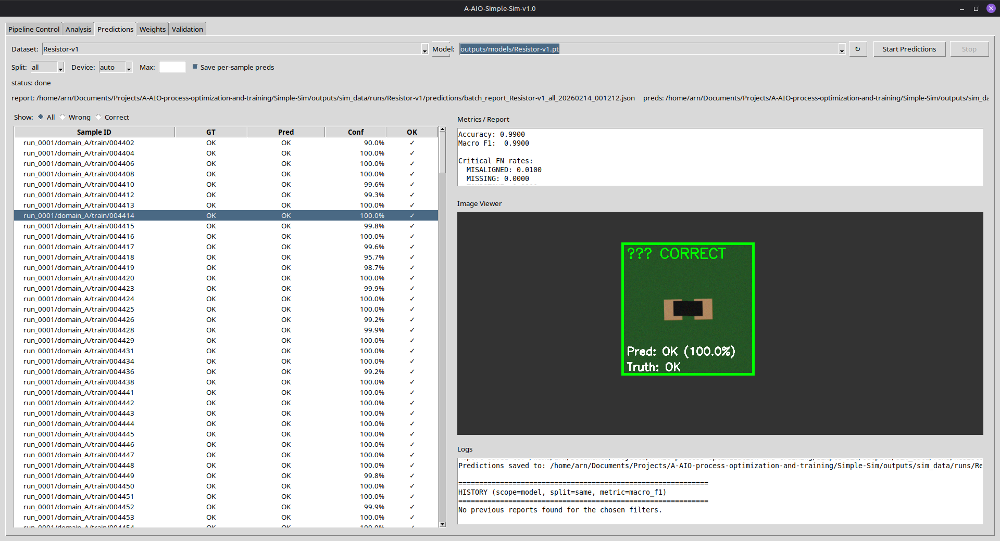
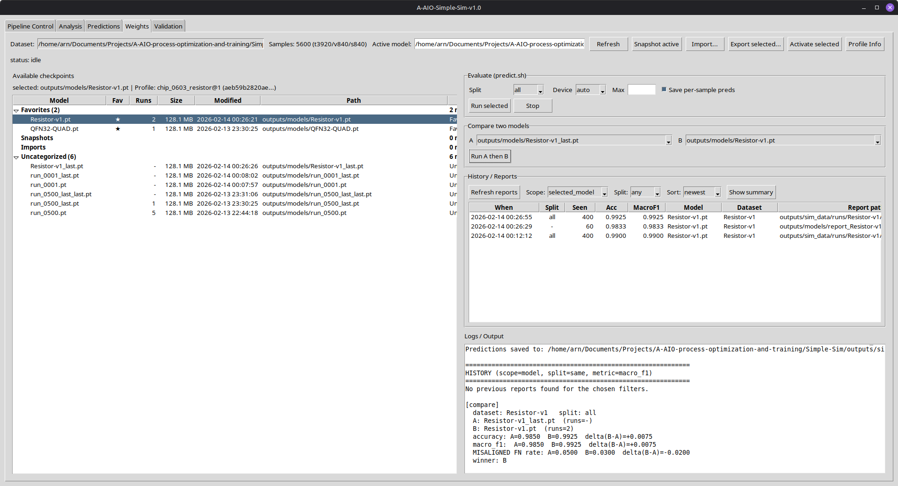
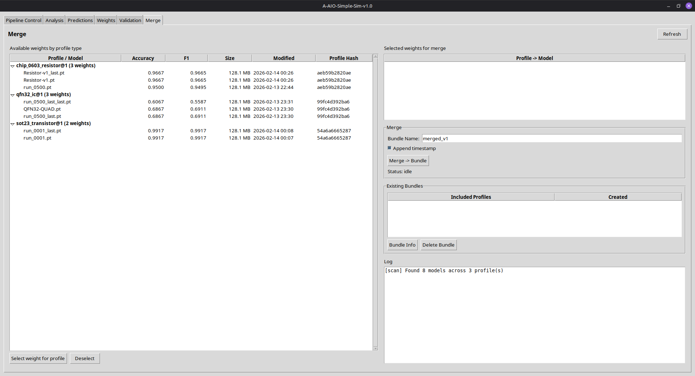

# Simple-Sim: Synthetic PCB Defect Detection System

Synthetic AOI-style ROI generation + training/evaluation pipeline for PCB component defect classification.


*Note:* Pipeline overview showing the end-to-end workflow (generate, validate, train, evaluate) and run status.

*Note:* Prediction view for scoring an ROI image and inspecting the predicted class and confidence.

*Note:* A/B testing view to compare two runs/models side-by-side using the same evaluation data.

*Note:* Weight merge view to combine per-profile checkpoints into a single multi-profile bundle.


## Overview

Simple-Sim generates deterministic synthetic datasets of PCB component defects for training and evaluating machine learning models.

Key idea: the pipeline is **profile-based**. A **component profile** (versioned YAML) defines the component geometry/tolerances/render defaults and the intended defect set for a component type (e.g. 0603 resistor, SOT-23 transistor, QFN-32 IC). Run configs select a profile via `run.component_profile`.

The system uses 2D OpenCV-based rendering to create AOI-like ROI images. Defect classes are **component-dependent**; common classes include:

- **OK**: Component within tolerance
- **MISSING**: Component not present
- **MISALIGNED**: Excessive shift or rotation
- **TOMBSTONE**: Component tilted beyond profile tolerance
- **SOLDER_BRIDGE**: Shorts between pads/leads (e.g. QFN)
- **CORNER_LIFT**: Lifted corner / partial non-wet (e.g. QFN)

## Features

- **Deterministic generation**: Every sample reproducible from (run_seed, domain, index)
- **Contract-based design**: Strict JSONL/YAML schemas with validation
- **Quality gates**: Validation at each pipeline stage
- **Modular structure**: Training/eval code decoupled from generation
- **Comprehensive metrics**: Accuracy, precision, recall, F1, confusion matrix, FN rates
- **Multi-component profiles (v1.0.1)**: Versioned profiles in `configs/profiles/` (resistor/SOT-23/QFN-32 included)
- **Provenance + safety (v1.0.1)**: Dataset manifests + profile hashing + pipeline guards to prevent profile/class mismatches
- **GUI profile awareness (v1.0.1)**: Profile dropdown, compatibility indicators, dataset/model profile display, info dialogs
- **Batch scoring with history (v1.0.1)**: `scripts/batch_predict.py` with report history compare and class-mismatch guards
- **Profile-filtered model selection (v1.0.1)**: Pipeline model dropdown only shows checkpoints matching the dataset profile
- **Weight merging (v1.0.1)**: Merge tab to combine per-profile checkpoints into a single multi-profile bundle

## Quick Start

### 1. Installation

```bash
cd Simple-Sim
python -m venv .venv
.venv/bin/python -m pip install -r requirements.txt
```

Offline install (no PyPI access):
```bash
cd Simple-Sim
python -m venv .venv
WHEELHOUSE=/path/to/wheelhouse .venv/bin/python -m pip install --no-index --find-links "$WHEELHOUSE" -r requirements.txt
```

To build a wheelhouse on a machine with internet:
```bash
cd Simple-Sim
./tools/build_wheelhouse.sh wheelhouse
```

## Component Profiles (New)

Profiles live in `configs/profiles/` and are versioned via `profile_id` like `chip_0603_resistor@1`.

Included profiles:
- `chip_0603_resistor@1`: 2-pad 0603 chip resistor (OK/MISSING/MISALIGNED/TOMBSTONE)
- `sot23_transistor@1`: 3-lead SOT-23 transistor (OK/MISSING/MISALIGNED/TOMBSTONE)
- `qfn32_ic@1`: QFN-32 IC (OK/MISSING/MISALIGNED/SOLDER_BRIDGE/CORNER_LIFT)

Reference run configs you can start from:
- `configs/run_0001.yaml` (0603 resistor, 256×256 ROI)
- `configs/run_sot23.yaml` (SOT-23 transistor, 256×256 ROI)
- `configs/run_qfn32.yaml` (QFN-32 IC, 768×768 ROI)


```bash
.venv/bin/python scripts/eval.py \
  --data outputs/sim_data/runs/run_0001 \
  --model outputs/models/run_0001.pt
```

**Outputs:**
- Console: Formatted metrics table
- File: `outputs/models/report_run_0001.json`
- Success criteria check results

## Manifests + Pipeline Guards (New)

Each generated dataset includes a `dataset_manifest.json` with provenance (profile id/hash/path, generator version, git commit) and extend history.

The CLI scripts include guards to prevent silent corruption, for example:
- `scripts/generate.py --extend ...` refuses to extend datasets if the profile id/hash differs
- `scripts/train.py --resume ...` refuses to resume across profile mismatches
- `scripts/predict.py` / `scripts/eval.py` / `scripts/batch_predict.py` validate dataset/model compatibility

Legacy datasets (without a manifest) can be migrated:
```bash
cd Simple-Sim
.venv/bin/python tools/backfill_manifest.py --data outputs/sim_data/runs/run_0001
```

Implementation notes: `PROFILE_SYSTEM_IMPLEMENTATION.md`.

## Configuration

Configuration files (`configs/*.yaml`) define all dataset and training parameters. See `configs/run_0001.yaml` for annotated reference.

### Key Sections

- **run**: Run ID, master seed, schema version
- **run.component_profile (v2)**: Component profile ID from `configs/profiles/`
- **roi**: Image dimensions, mm/pixel scaling
- **classes**: Sample counts per class
- **tolerances**: Classification thresholds (shift, rotation, tilt) (profile-provided in schema v2)
- **domains**: Lighting, blur, noise ranges per domain
- **splits**: Train/val/test fractions and domain assignments
- **render**: Colors, rendering backend
- **augment**: Rotation, brightness, contrast ranges
- **train**: Model, epochs, batch size, optimizer params
- **eval**: Batch size, metrics to compute

## Dataset Schema

### meta.jsonl
One row per sample with complete generation metadata:

```json
{
  "schema_version": 1,
  "id": "run_0001/domain_A/train/000042",
  "run_id": "run_0001",
  "domain": "domain_A",
  "split": "train",
  "seed": 1234567890123456789,
  "image_path": "images/000042.png",
  "render_backend": "opencv_2d",
  "footprint": "0603",
  "nominal": {...},
  "defect": {...},
  "augment": {...}
}
```

### labels.jsonl
One row per sample with class label:

```json
{
  "schema_version": 1,
  "id": "run_0001/domain_A/train/000042",
  "class_name": "MISALIGNED"
}
```

### splits/
- `train.txt`: Training sample IDs
- `val.txt`: Validation sample IDs
- `test.txt`: Test sample IDs

## Project Structure

```
Simple-Sim/
├── README.md
├── requirements.txt
├── configs/
│   ├── profiles/              # Versioned component profiles (YAML)
│   ├── run_0001.yaml          # 0603 resistor reference (schema v2 + profile)
│   ├── run_sot23.yaml         # SOT-23 transistor example
│   └── run_qfn32.yaml         # QFN-32 example (larger ROI + extra defect classes)
├── simple_sim/                # Core package
│   ├── schema.py              # Data contracts
│   ├── config.py              # Config validation
│   ├── rng.py                 # Deterministic seeding
│   ├── dataset_store.py       # Atomic dataset writing
│   ├── defects.py             # Defect classification
│   ├── generator_2d.py        # OpenCV rendering
│   ├── splits.py              # Stratified splitting
│   ├── metrics.py             # Evaluation metrics
│   ├── data_loader.py         # PyTorch Dataset
│   ├── manifest.py            # dataset_manifest.json read/write
│   ├── profile_hash.py        # Deterministic profile hashing + loading
│   └── model_bundle.py         # Multi-model bundle support
├── scripts/
│   ├── generate.py            # Dataset generation
│   ├── train.py               # Model training
│   ├── eval.py                # Test evaluation
│   ├── predict.py             # Single-image prediction
│   └── batch_predict.py       # Batch scoring + report history
├── tools/
│   ├── validate_dataset.py    # Dataset validation
│   ├── backfill_manifest.py   # Add manifest to legacy datasets
│   └── create_multi_dataset.py # Helper for multi-dataset workflows
├── gui/                       # Tkinter multi-tab GUI
│   ├── monitor.py             # Main application (MonitorAppTabbed)
│   ├── state.py               # Shared UI state
│   ├── tabs/
│   │   ├── pipeline_tab.py    # Pipeline control with profile-filtered model selection
│   │   ├── analysis_tab.py    # Image browser with defect overlays
│   │   ├── predictions_tab.py # Batch prediction interface
│   │   ├── weights_tab.py     # Checkpoint management and evaluation
│   │   ├── validation_tab.py  # Automated dataset validation
│   │   └── merge_tab.py       # Multi-profile weight merging into bundles
│   ├── components/            # Reusable UI components
│   └── utils/                 # Settings, tooltips, inference helpers
├── tests/                     # Unit tests
└── outputs/
    ├── sim_data/runs/         # Generated datasets
    └── models/                # Trained models and .bundle directories
```

## GUI Tabs

The GUI is a multi-tab Tkinter application launched via `./gui/run.sh`.

### Pipeline Control

Runs the generation/training/evaluation pipeline. Supports single, multiple, and continuous run modes. Dataset and model selection are profile-aware: the model dropdown only shows checkpoints whose embedded profile matches the selected dataset. Legacy checkpoints (no profile metadata) are listed at the bottom of the dropdown. Profile compatibility is checked and displayed next to the dataset info.

### Analysis

Interactive image browser with defect overlays. Allows browsing generated samples, viewing metadata, and inspecting per-sample defect parameters.

### Predictions

Batch prediction interface. Runs `predict.sh` against a dataset with a selected model and displays per-sample results with confidence scores.

### Weights

Model checkpoint management. Lists all checkpoints (active, snapshots, imports) grouped into categories. Supports snapshot, import, export, rename, duplicate, delete, favorites, and drag-and-drop grouping. Includes an evaluation runner to score any checkpoint against the current dataset and a compare mode to run two checkpoints side-by-side with a winner summary. Report history is searchable by scope, split, and sort order.

### Validation

Automated dataset validation with flagging. Runs structural and semantic checks on the selected dataset and reports issues.

### Merge

Combines profile-specific weights into a single multi-profile bundle. The tab scans all checkpoints under `outputs/models/`, groups them by their embedded `profile_id`, and displays them in a tree with columns for accuracy, F1, size, modification date, and profile hash. For each profile type, exactly one checkpoint can be selected. The merge operation copies the selected checkpoints into a `.bundle` directory and writes `bundle.json` metadata (using `simple_sim/model_bundle.py`). Existing bundles are listed with their included profiles and creation date, and can be inspected or deleted.

A merged bundle can be selected as a model in the Pipeline Control tab. When a bundle is used, the pipeline resolves the correct per-profile checkpoint based on the dataset manifest.

## Success Criteria

### Must-Have (Blocking)
- [x] 400 images generated in < 5 minutes
- [x] All JSONL rows valid (schema validation passes)
- [x] No split overlap (validation check passes)
- [x] Deterministic: same config → same labels
- [x] Training completes without errors
- [x] Val accuracy > 70% after 10 epochs
- [x] Test metrics saved to report.json with confusion matrix

### Nice-to-Have
- Val accuracy > 90% (indicates good separability)
- TOMBSTONE recall > 0.8 (validates 2D simulation quality)
- Generation speed > 100 samples/sec

## Troubleshooting

### Training not converging (val acc < 70%)
- Increase dataset size: 200 samples per class (800 total)
- Add dropout or increase L2 regularization
- Check class distribution in splits

### TOMBSTONE not distinguishable
- Increase tilt threshold to 80-85°
- Enhance visual difference (thinner vertical rectangle)
- Add shadows for depth cues

### Determinism verification fails
- Labels must match exactly
- Images only need SSIM > 0.99 (floating-point variations OK)
- Check random seed propagation

### CUDA out of memory
- Reduce batch size in config
- Use `--device cpu` flag
- Reduce image resolution in ROI config

## What's Deferred to M1+

- Multi-domain generation (MVP: single domain_A)
- Challenge sets (MVP: train/val/test only)
- 3D rendering with Blender (MVP: 2D OpenCV only)
- Dashboard/TensorBoard (MVP: console + JSON reports)
- Hyperparameter sweeps (MVP: single config)
- Advanced augmentation (MVP: basic blur/noise/brightness)
- More defect types (e.g. opens, insufficient solder, polarity/marking)

## Testing

Run unit tests:

```bash
.venv/bin/python -m pytest tests/
```

Run end-to-end pipeline test:

```bash
.venv/bin/python -m pytest tests/test_pipeline_e2e.py -v
```

## License

This project is **proprietary**. No permission is granted to use, copy, modify,
or distribute this software without prior written permission.

See [`../LICENSE`](../LICENSE).

Third-party dependencies remain under their own licenses; see
[`THIRD_PARTY_LICENSES.md`](THIRD_PARTY_LICENSES.md).
