# Sample Gallery

Auto-generated reference images for all component profiles (2D and 3D). Last updated: 2026-02-17 10:43:56

Re-generate by running:
```bash
.venv/bin/python tools/update_sample_gallery.py
```

## Table of Contents

- [2D Profiles](#2d-profiles)
  - [chip_0603_resistor@1](#chip-0603-resistor1)
  - [qfn32_ic@1](#qfn32-ic1)
  - [sot23_transistor@1](#sot23-transistor1)
- [3D Profiles](#3d-profiles)
  - [chip_0603_resistor_3d@1](#chip-0603-resistor-3d1)
  - [qfn32_ic_3d@1](#qfn32-ic-3d1)
  - [soic16_ic_3d@1](#soic16-ic-3d1)
  - [sot23_transistor_3d@1](#sot23-transistor-3d1)

## 2D Profiles

### chip_0603_resistor@1

| Class | Sample |
|-------|--------|
| MISALIGNED | 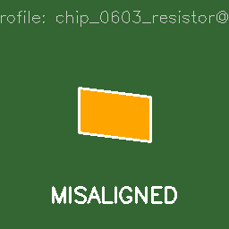 |
| MISSING | 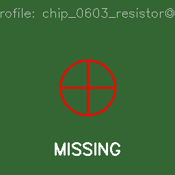 |
| OK | 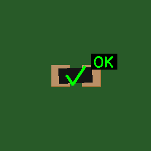 |
| TOMBSTONE | 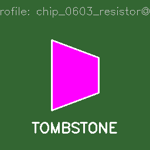 |

### qfn32_ic@1

| Class | Sample |
|-------|--------|
| MISALIGNED | 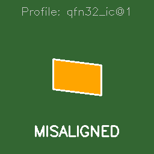 |
| MISSING | 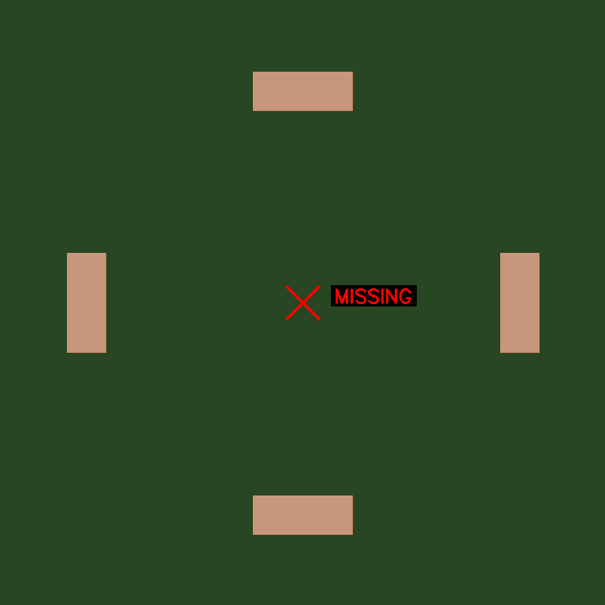 |
| OK | 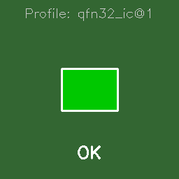 |
| TOMBSTONE | 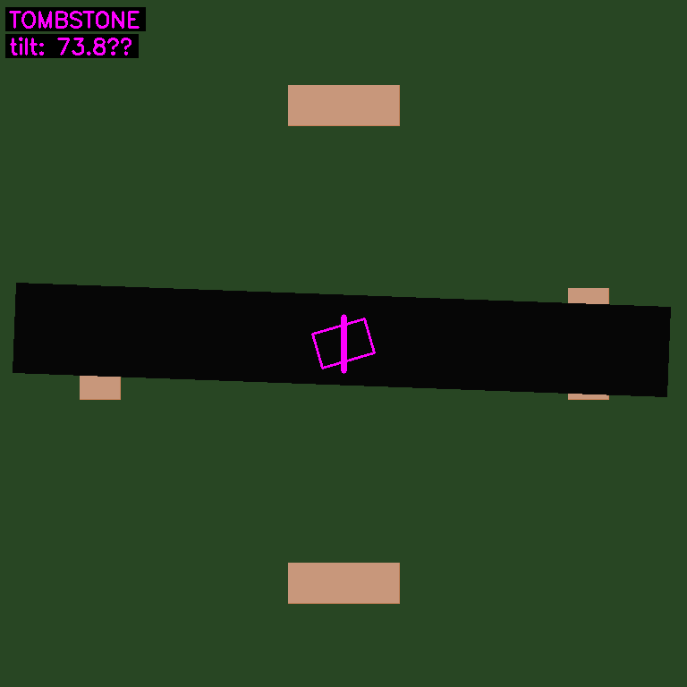 |

### sot23_transistor@1

| Class | Sample |
|-------|--------|
| MISALIGNED | 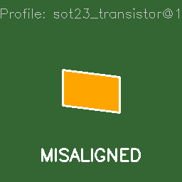 |
| MISSING | 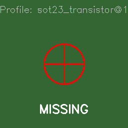 |
| OK | 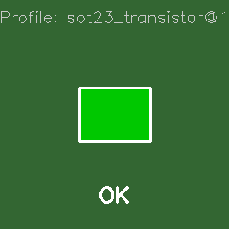 |
| TOMBSTONE | 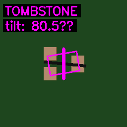 |

## 3D Profiles

### chip_0603_resistor_3d@1

| Class | Sample |
|-------|--------|
| MISALIGNED | 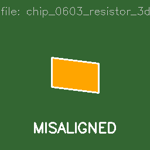 |
| MISSING | 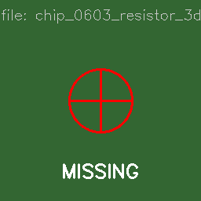 |
| OK |  |
| TOMBSTONE | 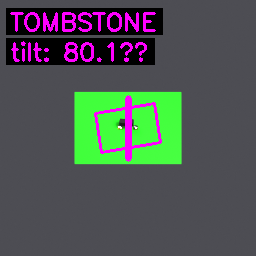 |

### qfn32_ic_3d@1

| Class | Sample |
|-------|--------|
| MISALIGNED | 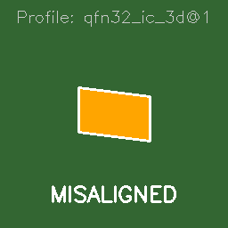 |
| MISSING | 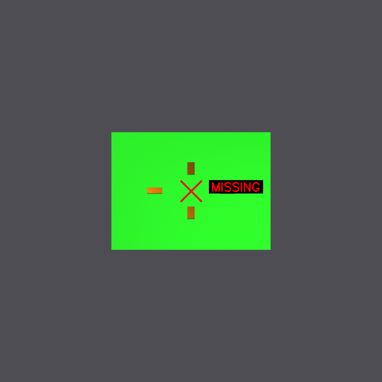 |
| OK | 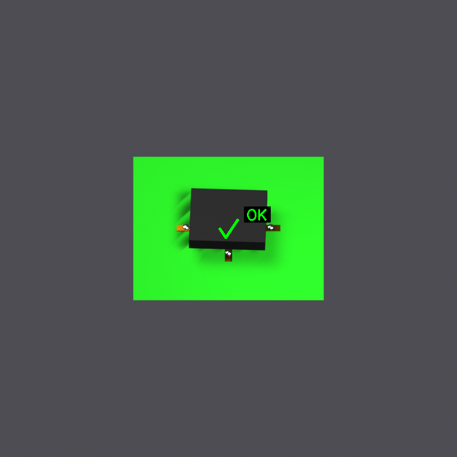 |
| TOMBSTONE | 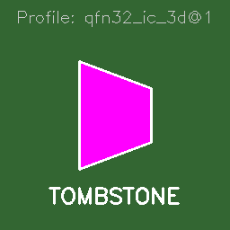 |

### soic16_ic_3d@1

| Class | Sample |
|-------|--------|
| MISALIGNED | 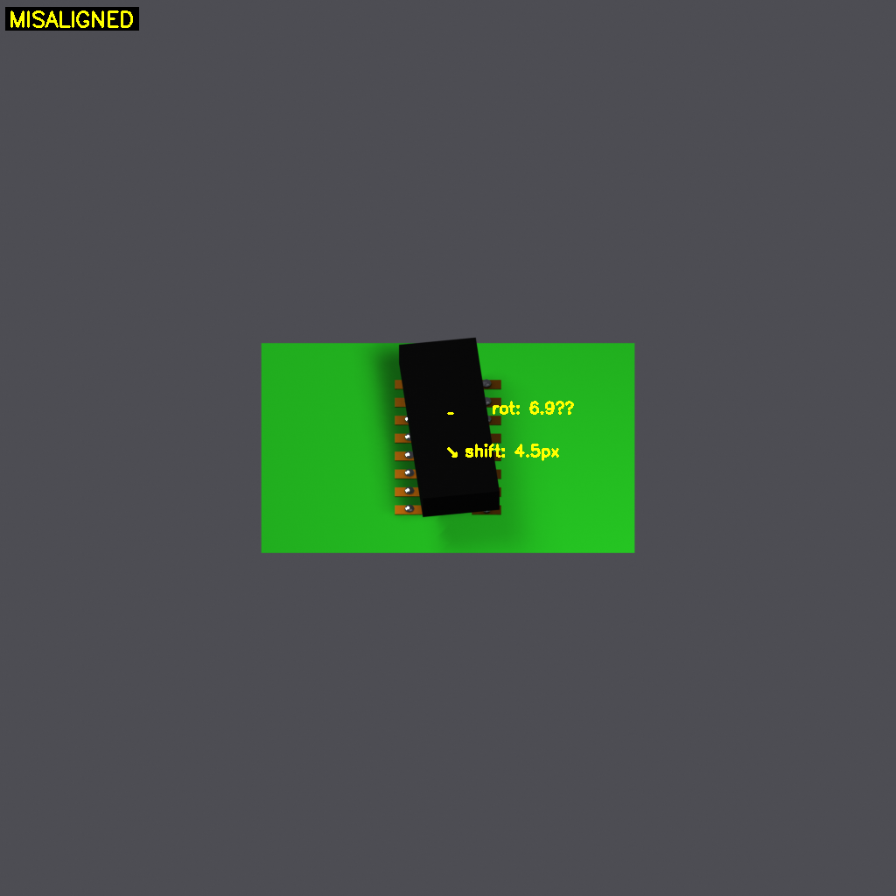 |
| MISSING | 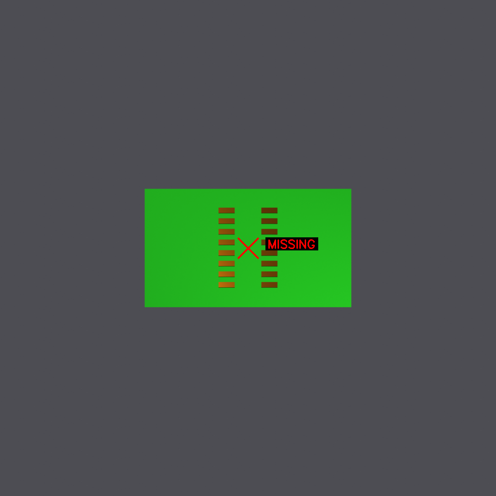 |
| OK | 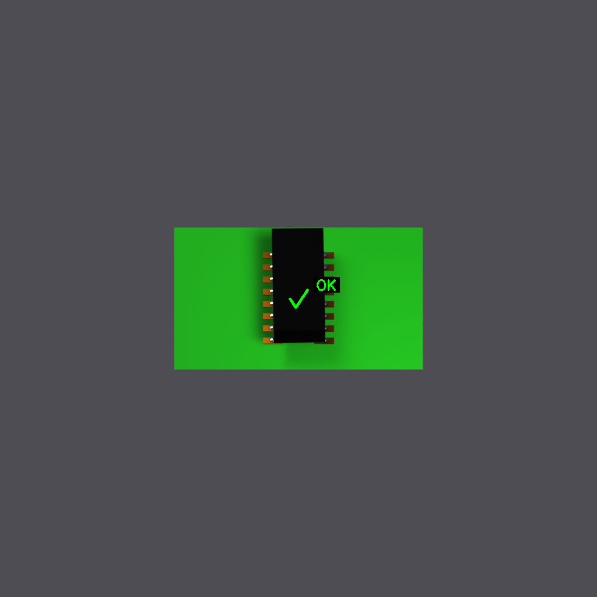 |
| TOMBSTONE | 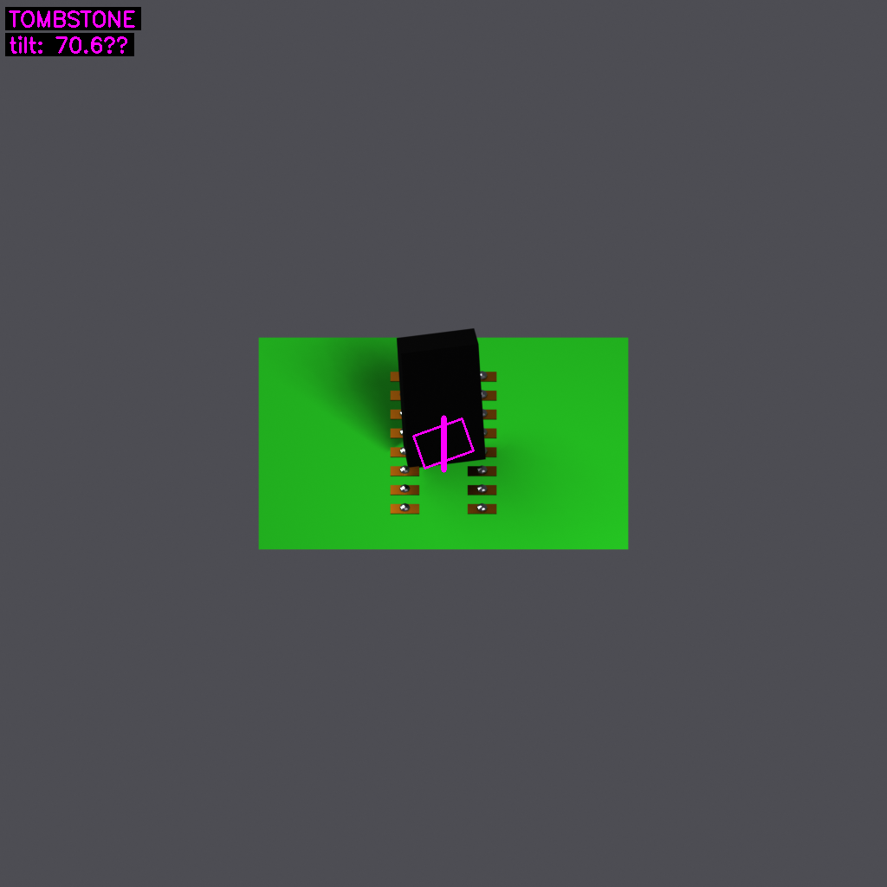 |

### sot23_transistor_3d@1

| Class | Sample |
|-------|--------|
| MISALIGNED | 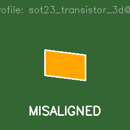 |
| MISSING | 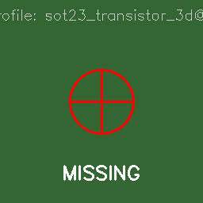 |
| OK | 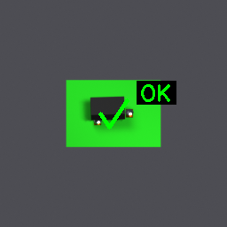 |
| TOMBSTONE | 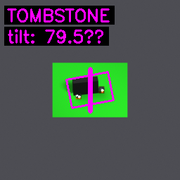 |

