# Sample Gallery

Auto-generated reference images from all available datasets (2D and 3D). Last updated: 2026-02-15 11:12:01

Re-generate by running:
```bash
.venv/bin/python tools/update_sample_gallery.py
```

## QFN-v1

Profile: `qfn32_ic@1`

| Class | Sample |
|-------|--------|
| MISALIGNED | 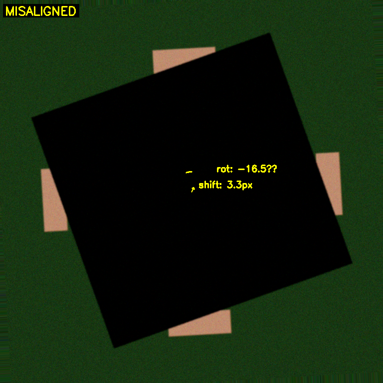 |
| MISSING | 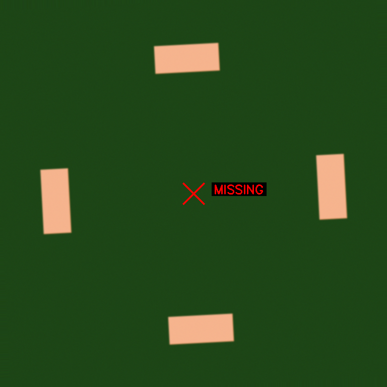 |
| OK | 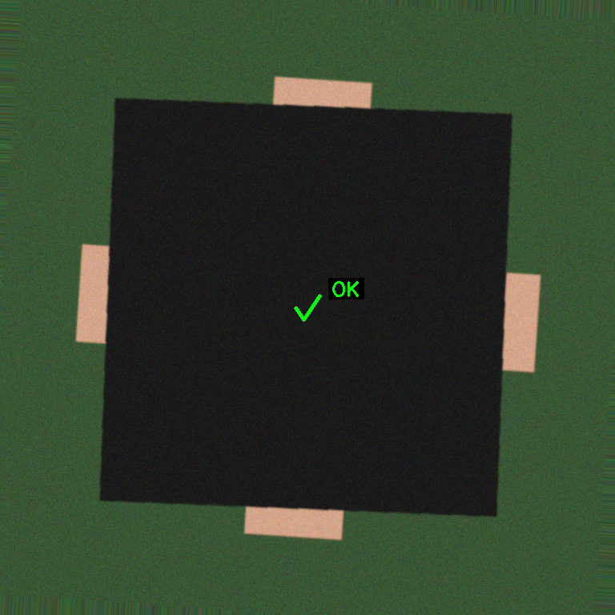 |
| TOMBSTONE | 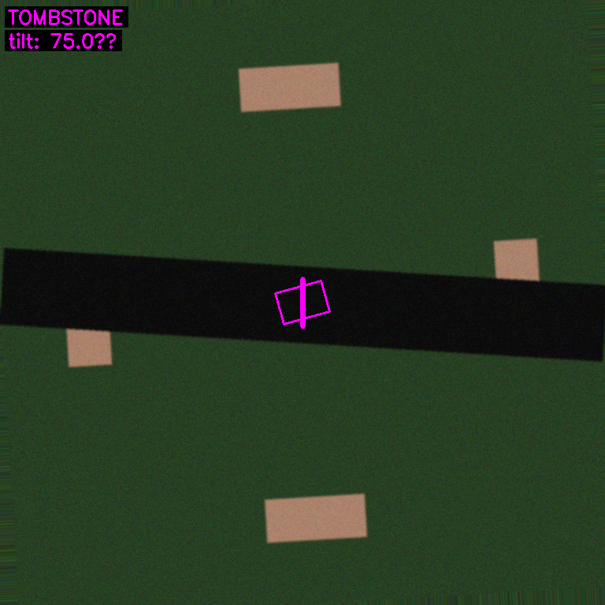 |

## Resistor-3D-v1

Profile: `chip_0603_resistor_3d@1`

| Class | Sample |
|-------|--------|
| MISALIGNED | 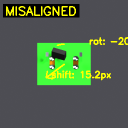 |
| MISSING |  |
| OK | 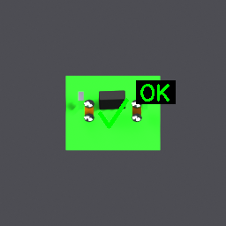 |
| TOMBSTONE | 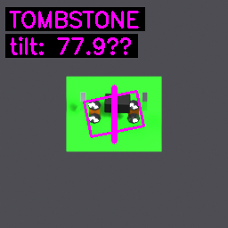 |

## Resistor-v1

Profile: `chip_0603_resistor@1`

| Class | Sample |
|-------|--------|
| MISALIGNED |  |
| MISSING |  |
| OK |  |
| TOMBSTONE |  |

## Transistor-v1

Profile: `sot23_transistor@1`

| Class | Sample |
|-------|--------|
| MISALIGNED | 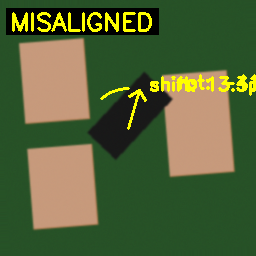 |
| MISSING | 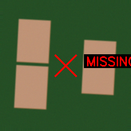 |
| OK | 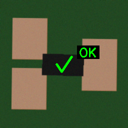 |
| TOMBSTONE | 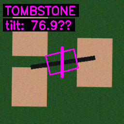 |

