# Sample Gallery

Auto-generated reference images from all available datasets. Last updated: 2026-02-14 11:30:25

Re-generate by running:
```bash
.venv/bin/python tools/update_sample_gallery.py
```

## Resistor-v1

Profile: `chip_0603_resistor@1`

| Class | Sample |
|-------|--------|
| MISALIGNED | 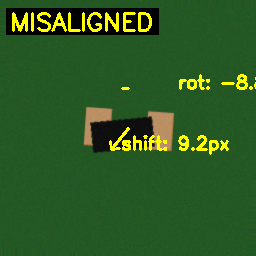 |
| MISSING |  |
| OK | 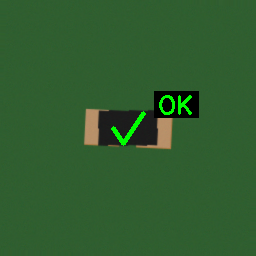 |
| TOMBSTONE | 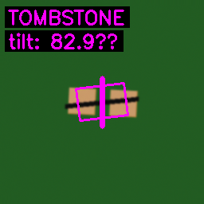 |

## Transistor-v2

Profile: `sot23_transistor@1`

| Class | Sample |
|-------|--------|
| MISALIGNED | 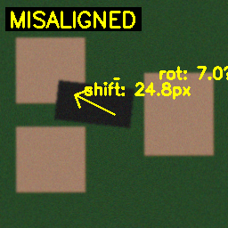 |
| MISSING | 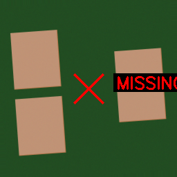 |
| OK | 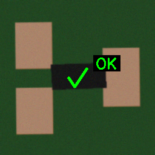 |
| TOMBSTONE | 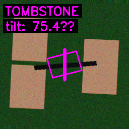 |

## run_qfn32

Profile: `qfn32_ic@1`

| Class | Sample |
|-------|--------|
| MISALIGNED | 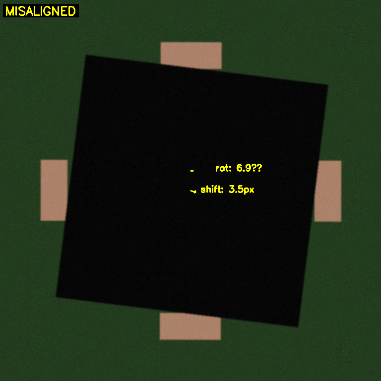 |
| MISSING | 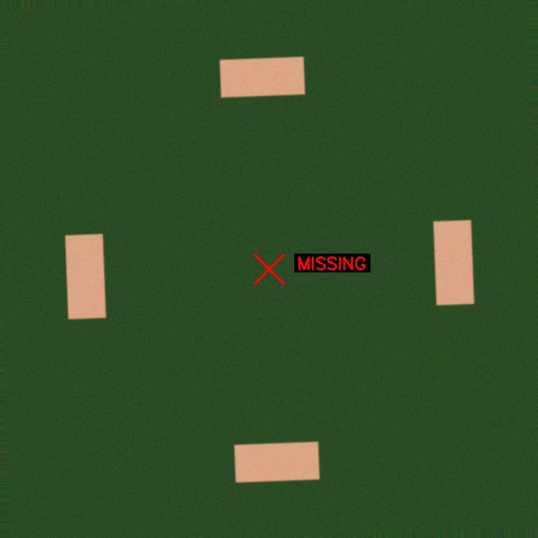 |
| OK | 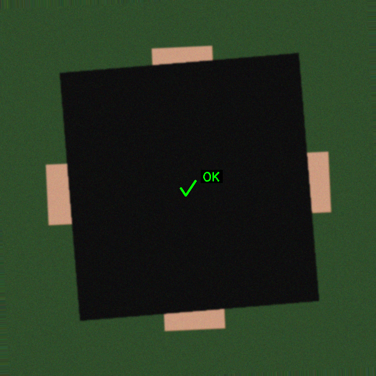 |
| TOMBSTONE | 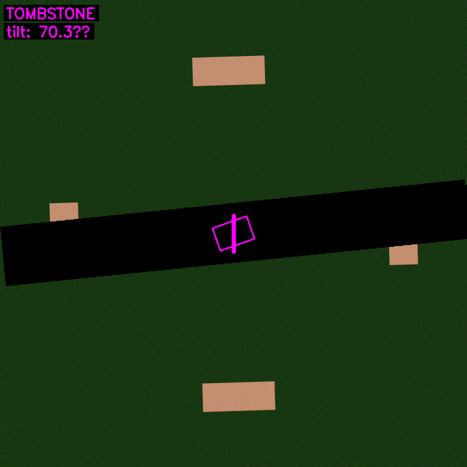 |

