# Sample Gallery

Auto-generated reference images for all component profiles (2D and 3D). Last updated: 2026-11-06 19:06:47

Re-generate by running:
```bash
.venv/bin/python tools/update_sample_gallery.py
```

## Table of Contents

- [2D Profiles](#2d-profiles)
  - [chip_0402_capacitor@1](#chip-0402-capacitor1)
  - [chip_0402_resistor@1](#chip-0402-resistor1)
  - [chip_0603_ferrite@1](#chip-0603-ferrite1)
  - [chip_0603_led@1](#chip-0603-led1)
  - [chip_0603_resistor@1](#chip-0603-resistor1)
  - [chip_0603_resistor@2](#chip-0603-resistor2)
  - [chip_1210_capacitor@1](#chip-1210-capacitor1)
  - [chip_2520_power_inductor@1](#chip-2520-power-inductor1)
  - [chip_array_8_capacitor@1](#chip-array-8-capacitor1)
  - [chip_array_8_resistor@1](#chip-array-8-resistor1)
  - [qfn32_ic@1](#qfn32-ic1)
  - [sot23_6_ic@1](#sot23-6-ic1)
  - [sot23_transistor@1](#sot23-transistor1)
  - [sot23_transistor@2](#sot23-transistor2)
  - [sot363_ic@1](#sot363-ic1)
  - [tssop14_ic@1](#tssop14-ic1)
  - [tssop20_ic@1](#tssop20-ic1)
- [3D Profiles](#3d-profiles)
  - [chip_0603_resistor_3d@2](#chip-0603-resistor-3d2)
  - [qfn32_ic_3d@2](#qfn32-ic-3d2)
  - [soic16_ic_3d@2](#soic16-ic-3d2)
  - [sot23_transistor_3d@2](#sot23-transistor-3d2)
  - [sot23_transistor_3d@3](#sot23-transistor-3d3)

## 2D Profiles

### chip_0402_capacitor@1

| Class | Sample |
|-------|--------|
| EXCESS_SOLDER | 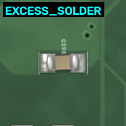 |
| MISALIGNED | 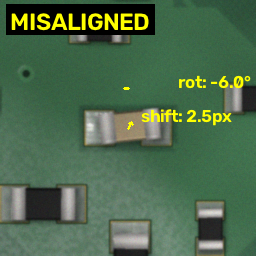 |
| MISSING | 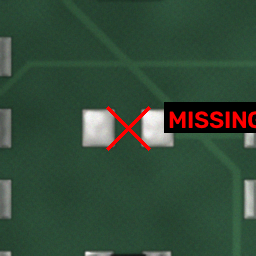 |
| OK | 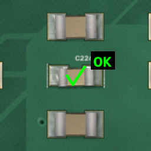 |
| SOLDER_BALL | 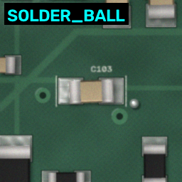 |
| TOMBSTONE | 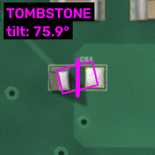 |

### chip_0402_resistor@1

| Class | Sample |
|-------|--------|
| EXCESS_SOLDER | 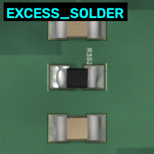 |
| MISALIGNED | 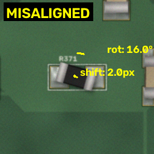 |
| MISSING | 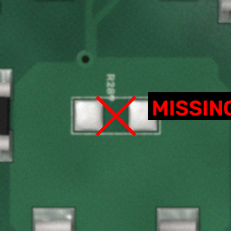 |
| OK | 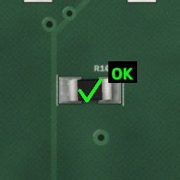 |
| SOLDER_BALL | 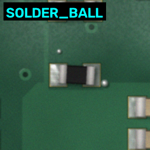 |
| TOMBSTONE | 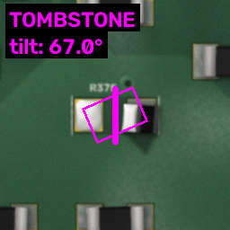 |

### chip_0603_ferrite@1

| Class | Sample |
|-------|--------|
| EXCESS_SOLDER | 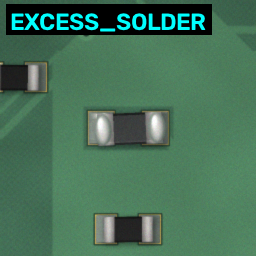 |
| MISALIGNED | 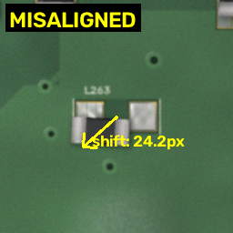 |
| MISSING | 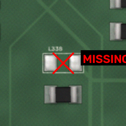 |
| OK | 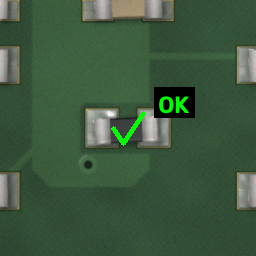 |
| SOLDER_BALL | 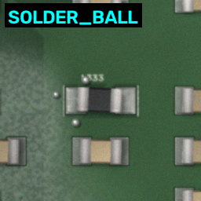 |
| TOMBSTONE | 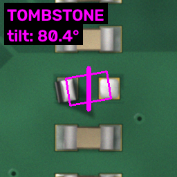 |

### chip_0603_led@1

| Class | Sample |
|-------|--------|
| EXCESS_SOLDER | 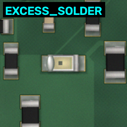 |
| MISALIGNED | 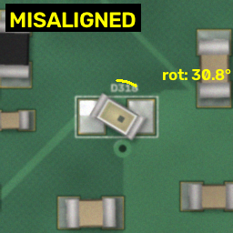 |
| MISSING | 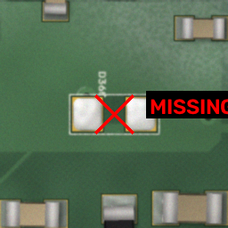 |
| OK | 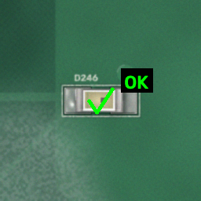 |
| SOLDER_BALL | 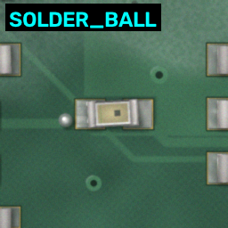 |
| TOMBSTONE | 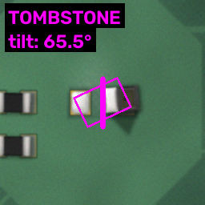 |

### chip_0603_resistor@1

| Class | Sample |
|-------|--------|
| MISALIGNED |  |
| MISSING |  |
| OK |  |
| TOMBSTONE |  |

### chip_0603_resistor@2

| Class | Sample |
|-------|--------|
| EXCESS_SOLDER | 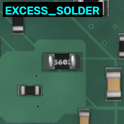 |
| MISALIGNED |  |
| MISSING |  |
| OK |  |
| SOLDER_BALL | 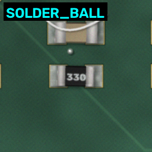 |
| TOMBSTONE |  |

### chip_1210_capacitor@1

| Class | Sample |
|-------|--------|
| EXCESS_SOLDER | 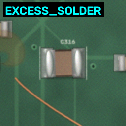 |
| MISALIGNED | 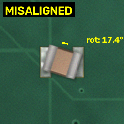 |
| MISSING | 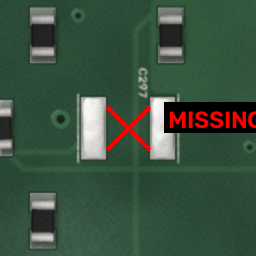 |
| OK | 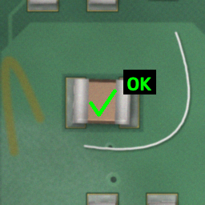 |
| SOLDER_BALL | 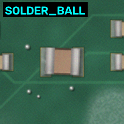 |
| TOMBSTONE | 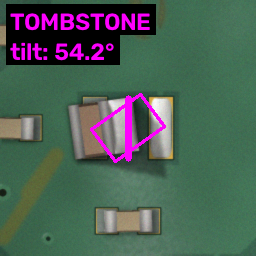 |

### chip_2520_power_inductor@1

| Class | Sample |
|-------|--------|
| EXCESS_SOLDER | 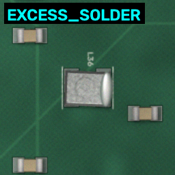 |
| MISALIGNED | 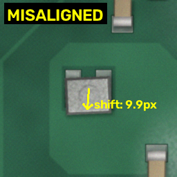 |
| MISSING | 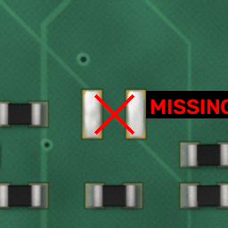 |
| OK | 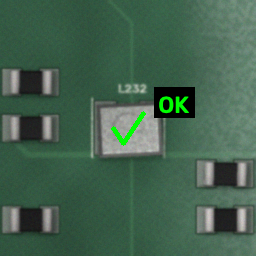 |
| SOLDER_BALL | 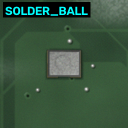 |

### chip_array_8_capacitor@1

| Class | Sample |
|-------|--------|
| EXCESS_SOLDER | 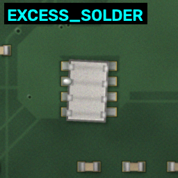 |
| MISALIGNED | 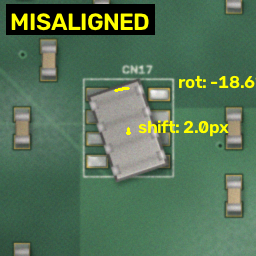 |
| MISSING | 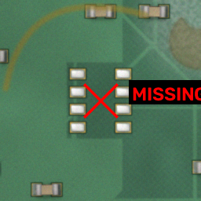 |
| OK | 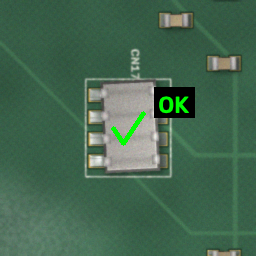 |
| SOLDER_BALL | 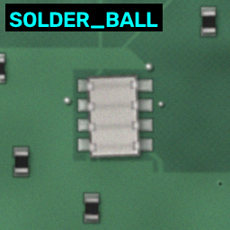 |
| SOLDER_BRIDGE | 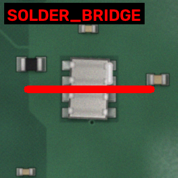 |

### chip_array_8_resistor@1

| Class | Sample |
|-------|--------|
| EXCESS_SOLDER | 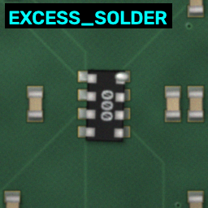 |
| MISALIGNED | 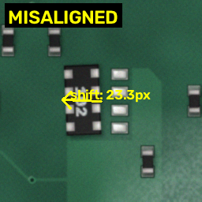 |
| MISSING | 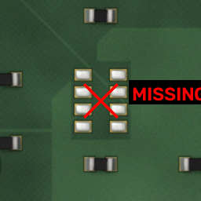 |
| OK | 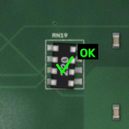 |
| SOLDER_BALL | 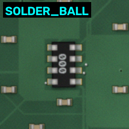 |
| SOLDER_BRIDGE | 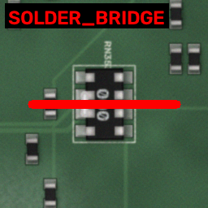 |

### qfn32_ic@1

| Class | Sample |
|-------|--------|
| MISALIGNED |  |
| MISSING |  |
| OK |  |
| TOMBSTONE |  |

### sot23_6_ic@1

| Class | Sample |
|-------|--------|
| EXCESS_SOLDER | 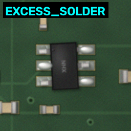 |
| MISALIGNED | 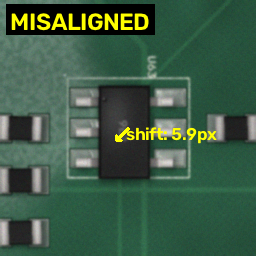 |
| MISSING | 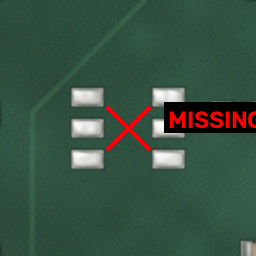 |
| OK | 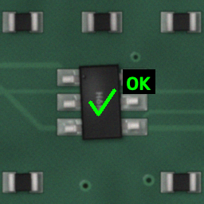 |
| SOLDER_BALL | 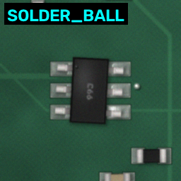 |
| SOLDER_BRIDGE | 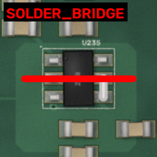 |

### sot23_transistor@1

| Class | Sample |
|-------|--------|
| MISALIGNED |  |
| MISSING |  |
| OK |  |
| TOMBSTONE |  |

### sot23_transistor@2

| Class | Sample |
|-------|--------|
| MISALIGNED | 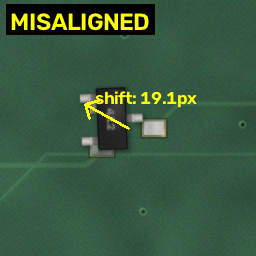 |
| MISSING | 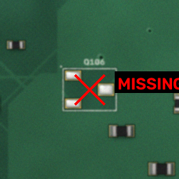 |
| OK | 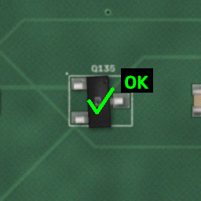 |
| TOMBSTONE | 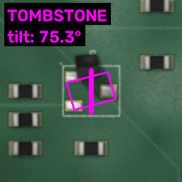 |

### sot363_ic@1

| Class | Sample |
|-------|--------|
| EXCESS_SOLDER | 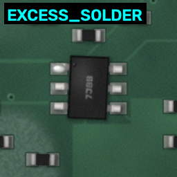 |
| MISALIGNED | 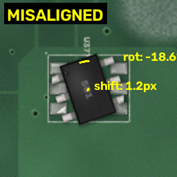 |
| MISSING | 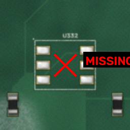 |
| OK | 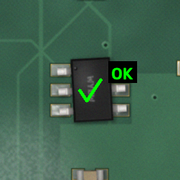 |
| SOLDER_BALL | 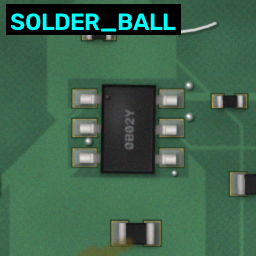 |
| SOLDER_BRIDGE | 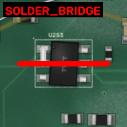 |

### tssop14_ic@1

| Class | Sample |
|-------|--------|
| EXCESS_SOLDER | 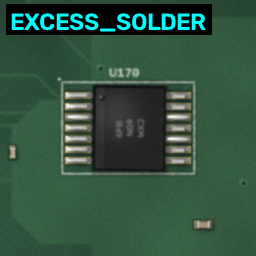 |
| MISALIGNED | 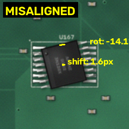 |
| MISSING | 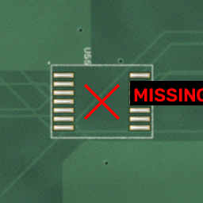 |
| OK | 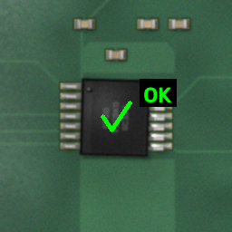 |
| SOLDER_BALL | 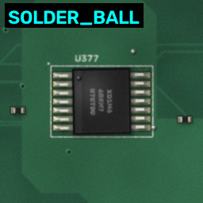 |
| SOLDER_BRIDGE | 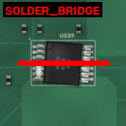 |

### tssop20_ic@1

| Class | Sample |
|-------|--------|
| EXCESS_SOLDER | 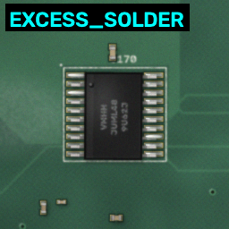 |
| MISALIGNED | 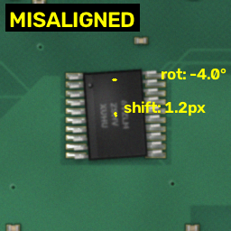 |
| MISSING | 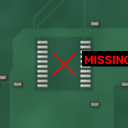 |
| OK | 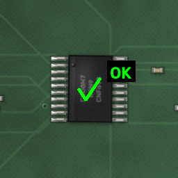 |
| SOLDER_BALL | 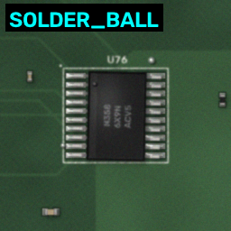 |
| SOLDER_BRIDGE | 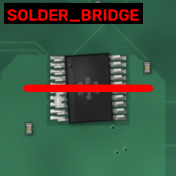 |

## 3D Profiles

### chip_0603_resistor_3d@2

| Class | Sample |
|-------|--------|
| EXCESS_SOLDER | 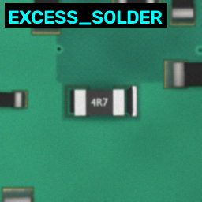 |
| MISALIGNED |  |
| MISSING |  |
| OK |  |
| SOLDER_BALL | 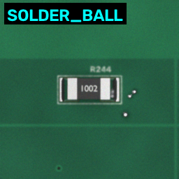 |
| TOMBSTONE |  |

### qfn32_ic_3d@2

| Class | Sample |
|-------|--------|
| EXCESS_SOLDER | 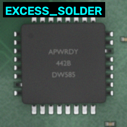 |
| MISALIGNED |  |
| MISSING |  |
| OK |  |
| SOLDER_BALL | 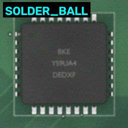 |
| TOMBSTONE |  |

### soic16_ic_3d@2

| Class | Sample |
|-------|--------|
| EXCESS_SOLDER | 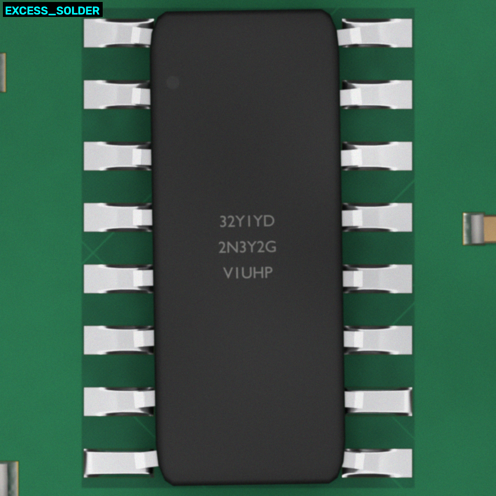 |
| MISALIGNED |  |
| MISSING |  |
| OK |  |
| SOLDER_BALL | 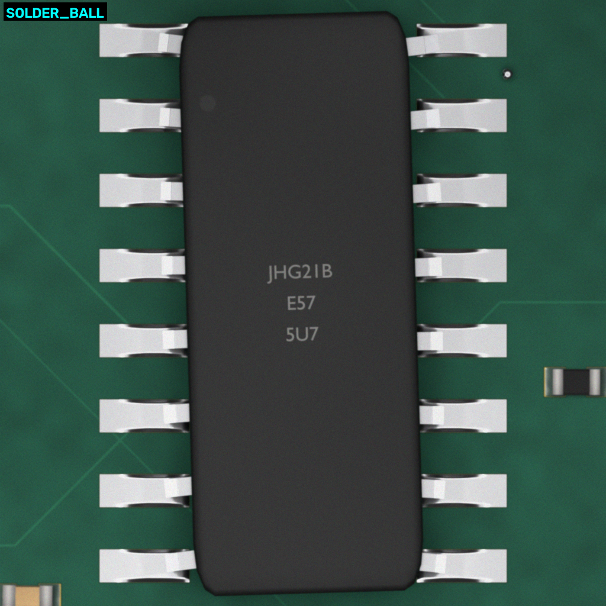 |
| TOMBSTONE |  |

### sot23_transistor_3d@2

| Class | Sample |
|-------|--------|
| EXCESS_SOLDER | 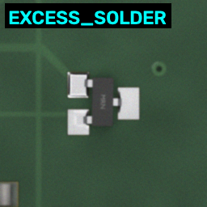 |
| MISALIGNED |  |
| MISSING |  |
| OK |  |
| SOLDER_BALL | 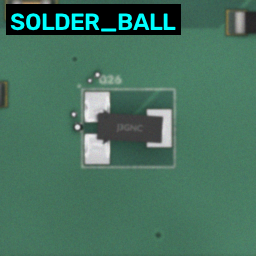 |
| TOMBSTONE |  |

### sot23_transistor_3d@3

| Class | Sample |
|-------|--------|
| EXCESS_SOLDER | 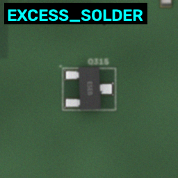 |
| MISALIGNED | 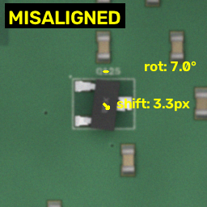 |
| MISSING | 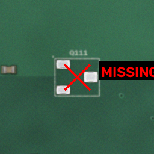 |
| OK | 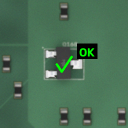 |
| SOLDER_BALL | 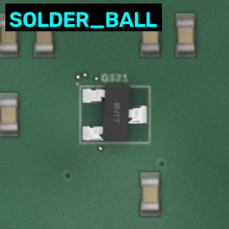 |
| TOMBSTONE | 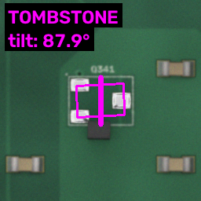 |

